# E-commerce Smart Agent v4.1 系统架构图

## 1. 整体架构图

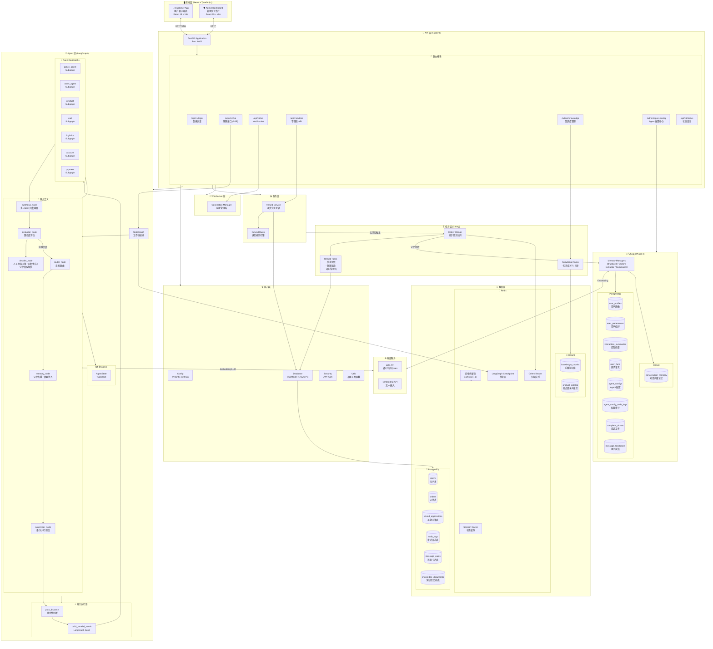

## 2. LangGraph 工作流详解

Phase 2 重构了 Agent 层的编排方式，引入 **Supervisor-based Graph**；Phase 3 进一步在工作流中嵌入 **记忆层** (`memory_node`)，实现长期上下文增强：

- `router_node` 负责意图识别与澄清，将结果写入 `AgentState`。
- `memory_node` 加载结构化记忆（`UserProfile`、`UserPreference`、`UserFact`、`InteractionSummary`）和向量对话记忆（`conversation_memory` 语义检索），生成 `memory_context` 并注入后续 Agent Prompt。
- `supervisor_node` 基于 `intent_result` 中的主意图和 `pending_intents`，通过 `plan_dispatch` 判断多个意图之间是否独立，决定**串行**或**并行**调度。
- 若为并行，通过 `build_parallel_sends` 生成多个 `LangGraph Send`，同时分发到不同的 `Agent Subgraph`。
- 各 `Agent Subgraph` 执行完毕后统一收敛到 `synthesis_node`，将多个专家回复融合为一段连贯回答。
- 之后进入 `evaluator_node` 进行置信度评估，低置信度时回到 `router_node` 重试。
- `decider_node` 在最终决策（人工接管/直接回复）后，触发 Celery 异步任务进行会话摘要与事实抽取。

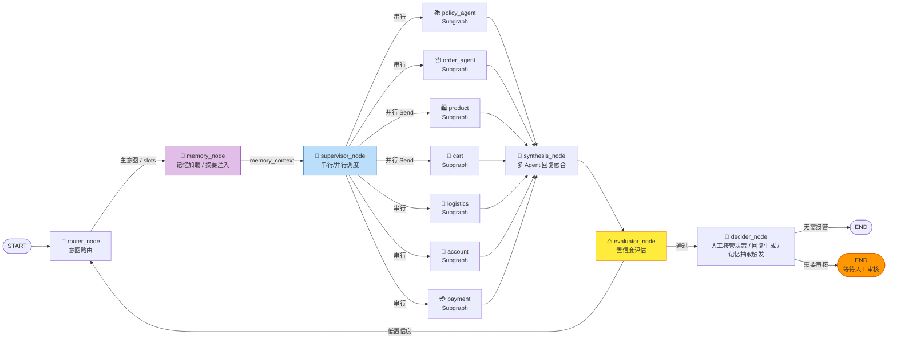

## 3. 数据模型关系图

```mermaid
erDiagram
    users ||--o{ orders : "拥有"
    users ||--o{ refund_applications : "申请"
    users ||--o{ audit_logs : "触发"
    users ||--o{ user_profiles : "拥有"
    users ||--o{ user_preferences : "拥有"
    users ||--o{ interaction_summaries : "拥有"
    users ||--o{ user_facts : "拥有"
    users ||--o{ complaint_tickets : "提交"
    users ||--o{ message_feedbacks : "提交"
    orders ||--o{ refund_applications : "关联"
    orders ||--o{ audit_logs : "关联"
    orders ||--o{ complaint_tickets : "关联"
    refund_applications ||--o{ audit_logs : "触发"


    users {
        int id PK
        string username UK
        string password_hash
        string email UK
        string full_name
        string phone
        boolean is_admin
        boolean is_active
        datetime created_at
        datetime updated_at
    }

    orders {
        int id PK
        string order_sn UK
        int user_id FK
        string status
        decimal total_amount
        json items
        string tracking_number
        string shipping_address
        datetime created_at
        datetime updated_at
    }

    refund_applications {
        int id PK
        int order_id FK
        int user_id FK
        string status
        string reason_category
        text reason_detail
        decimal refund_amount
        text admin_note
        int reviewed_by
        datetime reviewed_at
        datetime created_at
        datetime updated_at
    }

    audit_logs {
        int id PK
        string thread_id
        int order_id FK
        int refund_application_id FK
        int user_id FK
        text trigger_reason
        string risk_level
        string audit_level
        string trigger_type
        string action
        int admin_id
        text admin_comment
        json context_snapshot
        json decision_metadata
        json confidence_metadata
        datetime created_at
        datetime reviewed_at
        datetime updated_at
    }

    message_cards {
        int id PK
        string thread_id
        string message_type
        string status
        json content
        json meta_data
        string sender_type
        int sender_id
        int receiver_id
        datetime created_at
        datetime updated_at
    }

    knowledge_documents {
        int id PK
        string filename
        string storage_path
        string doc_type
        int chunk_count
        string status
        datetime created_at
        datetime updated_at
    }

    supervisor_decisions {
        int id PK
        string thread_id
        string primary_intent
        string pending_intents
        string selected_agents
        string execution_mode
        text reasoning
        datetime created_at
    }

    user_profiles {
        int id PK
        int user_id FK
        string membership_level
        string preferred_language
        string timezone
        int total_orders
        float lifetime_value
        datetime created_at
        datetime updated_at
    }

    user_preferences {
        int id PK
        int user_id FK
        string preference_key
        string preference_value
        datetime created_at
        datetime updated_at
    }

    interaction_summaries {
        int id PK
        int user_id FK
        string thread_id
        text summary_text
        string resolved_intent
        float satisfaction_score
        datetime created_at
        datetime updated_at
    }

    user_facts {
        int id PK
        int user_id FK
        string fact_type
        text content
        float confidence
        string source_thread_id
        datetime created_at
        datetime updated_at
    }

    agent_configs {
        int id PK
        string agent_name UK
        text system_prompt
        text previous_system_prompt
        float confidence_threshold
        int max_retries
        boolean enabled
        datetime updated_at
    }

    agent_config_audit_logs {
        int id PK
        string agent_name
        int changed_by
        string field_name
        text old_value
        text new_value
        datetime created_at
    }

    complaint_tickets {
        int id PK
        int user_id FK
        string thread_id
        string order_sn
        string category
        string urgency
        string status
        text description
        text expected_resolution
        text resolution_notes
        int assigned_to FK
        datetime created_at
        datetime updated_at
    }

    message_feedbacks {
        int id PK
        string thread_id
        int message_index
        string sentiment
        text comment
        int user_id FK
        datetime created_at
    }

    quality_scores {
        int id PK
        string thread_id
        float coherence
        float helpfulness
        float safety
        float overall
        text reasoning
        datetime created_at
    }

    knowledge_chunks[Qdrant Collection: knowledge_chunks] {
        string source
        text content
        vector embedding
        boolean is_active
        datetime created_at
    }

    product_catalog[Qdrant Collection: product_catalog] {
        string source
        text content
        vector embedding
        json meta_data
        datetime created_at
    }

    conversation_memory[Qdrant Collection: conversation_memory] {
        string thread_id
        string message_id
        string role
        text content
        vector embedding
        json meta_data
        datetime created_at
    }
```

## 4. 系统交互流程图

### 4.1 订单查询流程

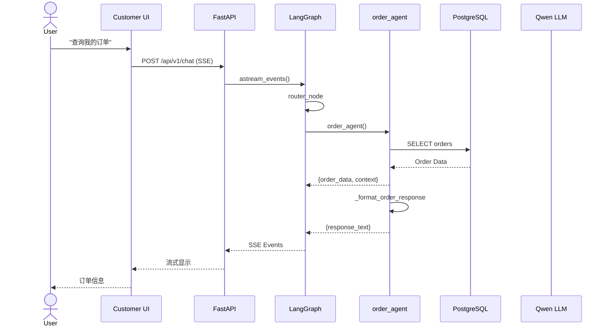

### 4.2 退货申请 + 风控审核流程

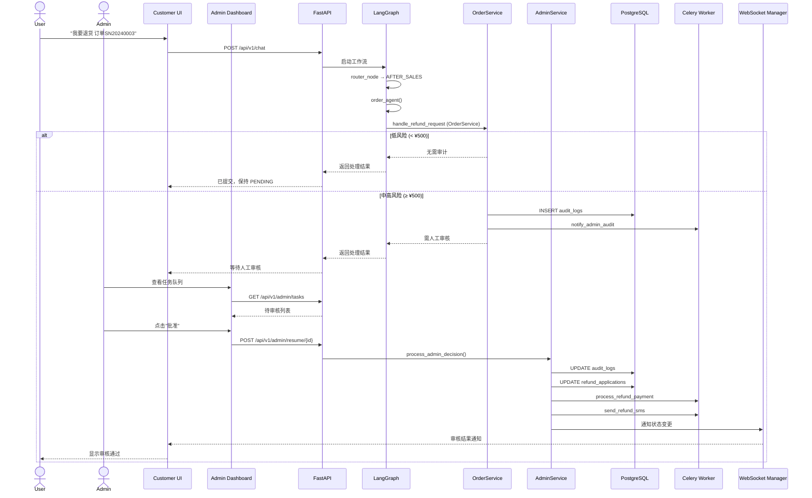

### 4.3 政策咨询 (RAG) 流程

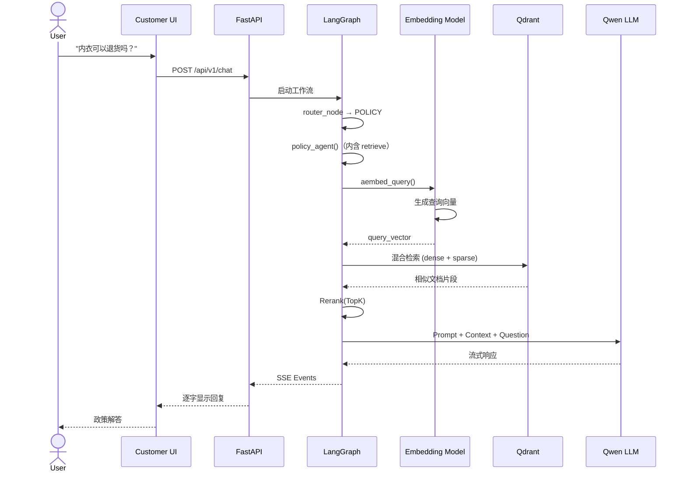

### 4.4 商品查询流程

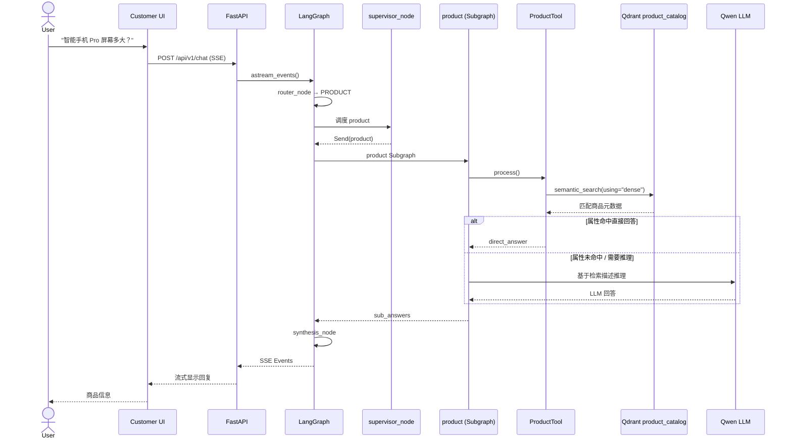

### 4.5 购物车管理流程

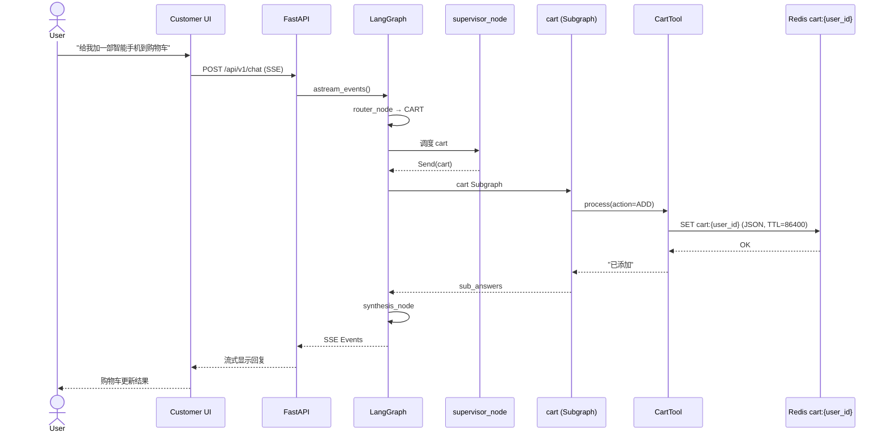

### 4.6 并行多意图执行流程

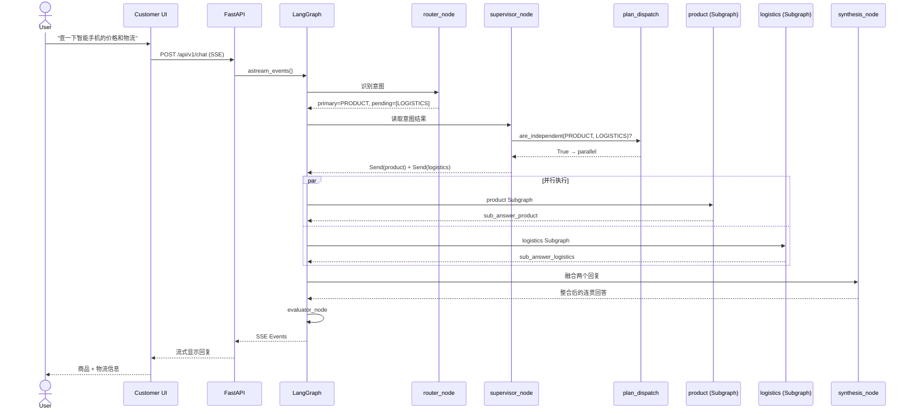

### 4.7 B端知识库上传与同步流程

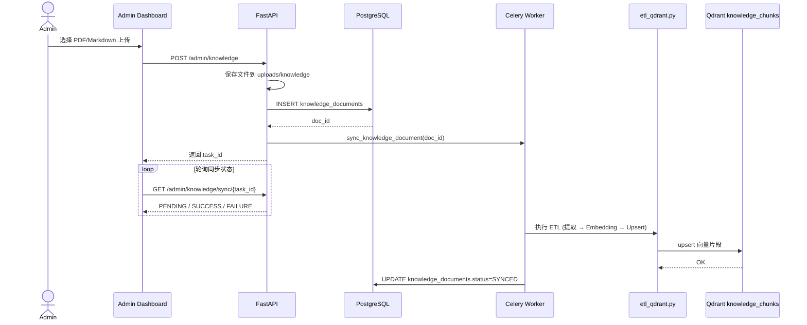

### 4.8 记忆系统加载流程

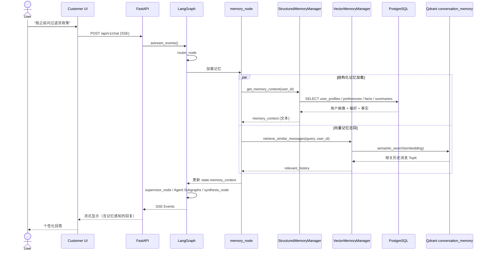

### 4.9 Agent 配置中心流程

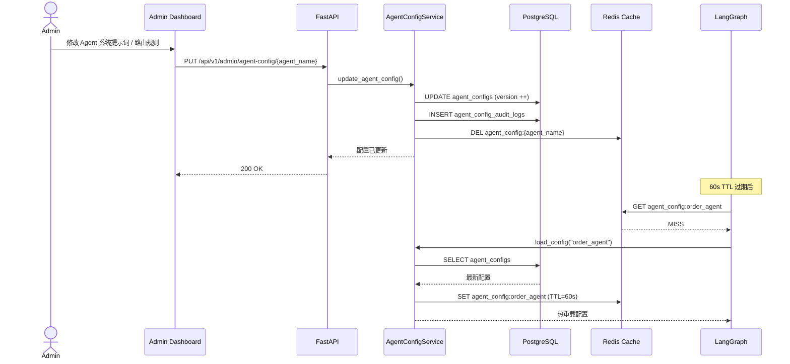

## 5. 技术栈分层

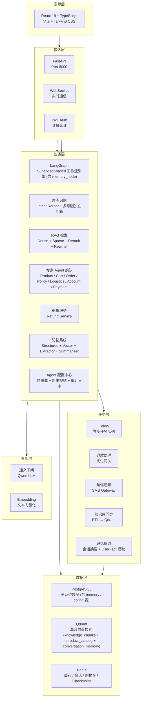

## 6. 项目文件结构

```
E-commerce-Smart-Agent/
├── 📄 README.md                    # 项目文档
├── 📄 architecture.md              # 系统架构文档
├── 📄 .env.example                 # 环境变量模板
├── 📄 alembic.ini                  # Alembic 迁移配置
├── 📄 pyproject.toml               # Python 项目配置 (uv)
├── 📄 uv.lock                      # uv 依赖锁定文件
├── 📄 docker-compose.yaml          # 容器编排配置
├── 📄 celery_worker.py             # Celery Worker 启动脚本
│
├── 📁 app/                         # 主应用目录
│   ├── 📄 main.py                  # FastAPI 应用入口
│   ├── 📄 celery_app.py            # Celery 配置
│   │
│   ├── 📁 api/v1/                  # API 路由层
│   │   ├── 📄 auth.py              # 认证接口 (登录)
│   │   ├── 📄 chat.py              # 聊天接口 (SSE 流式)
│   │   ├── 📄 chat_utils.py        # SSE 流式响应工具
│   │   ├── 📄 admin.py             # 管理员接口 (含知识库 CRUD + 同步)
│   │   ├── 📁 admin/
│   │   │   ├── 📄 agent_config.py  # Agent 配置中心 API (路由规则 / 提示词 / 审计日志)
│   │   │   ├── 📄 complaints.py    # 投诉工单管理 API (Phase 4)

│   │   │   ├── 📄 feedback.py      # 用户反馈与质量评估 API (Phase 4)
│   │   │   └── 📄 analytics.py     # 高级分析 API (Phase 4)
│   │   ├── 📄 status.py            # 状态查询接口
│   │   ├── 📄 websocket.py         # WebSocket 端点
│   │   └── 📄 schemas.py           # Pydantic 数据模型
│   │
│   ├── 📁 core/                    # 核心基础设施
│   │   ├── 📄 config.py            # 配置管理 (Pydantic Settings)
│   │   ├── 📄 database.py          # 数据库连接 (SQLModel)
│   │   ├── 📄 redis.py             # 统一 Redis 客户端
│   │   ├── 📄 security.py          # JWT 认证
│   │   ├── 📄 limiter.py           # API 限流 (slowapi)
│   │   ├── 📄 llm_factory.py       # LLM 实例工厂
│   │   ├── 📄 logging.py           # 结构化日志 (correlation_id)
│   │   └── 📄 utils.py             # 工具函数（utc_now 等）
│   │
│   ├── 📁 models/                  # 数据库模型 (SQLModel)
│   │   ├── 📄 user.py              # 用户表
│   │   ├── 📄 order.py             # 订单表
│   │   ├── 📄 refund.py            # 退款申请表
│   │   ├── 📄 audit.py             # 审计日志表
│   │   ├── 📄 message.py           # 消息卡片表
│   │   ├── 📄 knowledge_document.py # 知识库文档表
│   │   ├── 📄 observability.py     # 可观测性模型
│   │   ├── 📄 memory.py            # 记忆模型 (UserProfile / UserPreference / InteractionSummary / UserFact / AgentConfig / AuditLog)
│   │   ├── 📄 complaint.py         # 投诉工单模型 (Phase 4)

│   │   ├── 📄 evaluation.py        # 在线评估模型 (Phase 4)
│   │   └── 📄 state.py             # AgentState TypedDict
│   │
│   ├── 📁 memory/                  # 记忆系统 (Phase 3)
│   │   ├── 📄 __init__.py
│   │   ├── 📄 structured_manager.py # 结构化记忆管理器 (PostgreSQL)
│   │   ├── 📄 vector_manager.py    # 向量对话记忆管理器 (Qdrant conversation_memory)
│   │   ├── 📄 extractor.py         # 事实抽取器 (FactExtractor)
│   │   └── 📄 summarizer.py        # 会话摘要器 (SessionSummarizer)
│   │
│   ├── 📁 graph/                   # LangGraph 核心逻辑
│   │   ├── 📄 workflow.py          # 工作流定义 (含 Supervisor 模式与兼容模式)
│   │   ├── 📄 nodes.py             # 节点定义 (router / supervisor / synthesis / evaluator / decider)
│   │   ├── 📄 subgraphs.py         # Agent Subgraph 标准化封装
│   │   └── 📄 parallel.py          # 并行多意图调度 (plan_dispatch + build_parallel_sends)
│   │
│   ├── 📁 agents/                  # Agent 实现层
│   │   ├── 📄 base.py              # Agent 基类
│   │   ├── 📄 router.py            # IntentRouterAgent
│   │   ├── 📄 supervisor.py        # SupervisorAgent (串行/并行调度)
│   │   ├── 📄 order.py             # 订单 Agent
│   │   ├── 📄 policy.py            # 政策 Agent
│   │   ├── 📄 product.py           # 商品 Agent (ProductAgent)
│   │   ├── 📄 cart.py              # 购物车 Agent (CartAgent)
│   │   ├── 📄 logistics.py         # 物流 Agent
│   │   ├── 📄 account.py           # 账户 Agent
│   │   ├── 📄 payment.py           # 支付 Agent
│   │   ├── 📄 complaint.py         # 投诉 Agent (ComplaintAgent, Phase 4)
│   │   └── 📄 evaluator.py         # ConfidenceEvaluator
│   │
│   ├── 📁 tools/                   # Agent Tool 层
│   │   ├── 📄 __init__.py
│   │   ├── 📄 product_tool.py      # 商品检索 Tool (Qdrant product_catalog)
│   │   ├── 📄 cart_tool.py         # 购物车操作 Tool (Redis)
│   │   ├── 📄 logistics_tool.py    # 物流查询 Tool
│   │   ├── 📄 account_tool.py      # 账户查询 Tool
│   │   ├── 📄 payment_tool.py      # 支付查询 Tool
│   │   └── 📄 complaint_tool.py    # 投诉工单创建 Tool (Phase 4)
│   │
│   ├── 📁 confidence/              # 置信度信号模块
│   │   ├── 📄 __init__.py
│   │   └── 📄 signals.py           # 置信度评估信号计算
│   │
│   ├── 📁 utils/                   # 通用工具函数
│   │   └── 📄 order_utils.py       # 订单相关工具
│   │
│   ├── 📁 intent/                  # 意图识别模块
│   │   ├── 📄 service.py           # IntentRecognitionService (Redis 会话/缓存)
│   │   ├── 📄 models.py            # 意图/槽位/澄清状态数据模型
│   │   ├── 📄 config.py            # 意图识别配置
│   │   ├── 📄 classifier.py        # 意图分类器
│   │   ├── 📄 clarification.py     # 澄清引擎
│   │   ├── 📄 slot_validator.py    # 槽位验证器
│   │   ├── 📄 topic_switch.py      # 话题切换检测
│   │   ├── 📄 multi_intent.py      # 多意图处理器 (含独立性判断)
│   │   └── 📄 safety.py            # 安全过滤器
│   │
│   ├── 📁 retrieval/               # RAG 检索层
│   │   ├── 📄 client.py            # 检索客户端
│   │   ├── 📄 embeddings.py        # 向量嵌入
│   │   ├── 📄 retriever.py         # 检索器
│   │   ├── 📄 reranker.py          # 精排器
│   │   ├── 📄 rewriter.py          # 查询重写器
│   │   └── 📄 sparse_embedder.py   # 稀疏嵌入
│   │
│   ├── 📁 services/                # 业务服务层
│   │   ├── 📄 refund_service.py    # 退货业务逻辑
│   │   ├── 📄 status_service.py    # 状态服务
│   │   ├── 📄 order_service.py     # 订单服务
│   │   ├── 📄 admin_service.py     # 管理员服务
│   │   ├── 📄 auth_service.py      # 认证服务
│   │   ├── 📄 experiment.py        # A/B 实验服务 (Phase 4)

│   │   └── 📄 online_eval.py       # 在线评估服务 (Phase 4)
│   │
│   ├── 📁 schemas/                 # 共享 Schema
│   │   ├── 📄 auth.py
│   │   ├── 📄 admin.py
│   │   └── 📄 status.py
│   │
│   ├── 📁 tasks/                   # Celery 异步任务
│   │   ├── 📄 __init__.py
│   │   ├── 📄 refund_tasks.py      # 退款相关任务
│   │   ├── 📄 knowledge_tasks.py   # 知识库同步任务
│   │   ├── 📄 memory_tasks.py      # 记忆抽取与同步任务
│   │   └── 📄 notifications.py     # 告警通知任务 (Phase 4)
│   │
│   ├── 📁 websocket/               # WebSocket 服务
│   │   └── 📄 manager.py           # 连接管理器
│   │
│
├── 📁 frontend/                    # React 前端 (Vite + TypeScript)
│   ├── 📄 package.json             # npm 依赖配置
│   ├── 📄 package-lock.json        # npm 锁定文件
│   ├── 📄 vite.config.ts           # Vite 多页面配置
│   ├── 📄 tailwind.config.ts       # Tailwind CSS 配置
│   ├── 📄 tsconfig.json            # TypeScript 配置
│   ├── 📄 tsconfig.node.json       # Vite Node 类型配置
│   ├── 📄 components.json          # shadn/ui 组件注册表
│   ├── 📄 postcss.config.mjs       # PostCSS 配置
│   ├── 📄 eslint.config.js         # ESLint 配置
│   ├── 📄 playwright.config.ts     # Playwright E2E 配置
│   ├── 📄 index.html               # C端入口
│   ├── 📄 admin.html               # B端入口
│   │
│   └── 📁 src/
│       ├── 📁 apps/
│       │   ├── 📁 customer/        # C端用户应用
│       │   │   ├── 📄 App.tsx
│       │   │   ├── 📄 main.tsx
│       │   │   ├── 📁 hooks/
│       │   │   │   └── 📄 useChat.ts
│       │   │   └── 📁 components/
│       │   │       ├── 📄 ChatMessageList.tsx
│       │   │       └── 📄 ChatInput.tsx
│       │   │
│       │   └── 📁 admin/           # B端管理后台
│       │       ├── 📄 App.tsx
│       │       ├── 📄 main.tsx
│       │       ├── 📁 pages/
│       │       │   ├── 📄 Login.tsx
│       │       │   ├── 📄 Dashboard.tsx
│       │       │   ├── 📄 KnowledgeBase.tsx      # 知识库管理页面
│       │       │   └── 📄 AgentConfig.tsx        # Agent 配置中心页面
│       │       └── 📁 components/
│       │           ├── 📄 DecisionPanel.tsx
│       │           ├── 📄 NotificationToast.tsx
│       │           ├── 📄 TaskDetail.tsx
│       │           ├── 📄 TaskList.tsx
│       │           ├── 📄 ConversationLogs.tsx
│       │           ├── 📄 EvaluationViewer.tsx
│       │           ├── 📄 Performance.tsx
│       │           ├── 📄 KnowledgeBaseManager.tsx  # 知识库上传/同步组件
│       │           ├── 📄 AgentConfigEditor.tsx     # Agent 配置编辑器组件
│       │           ├── 📄 ComplaintQueue.tsx        # 投诉工单管理 (Phase 4)

│       │           └── 📄 AnalyticsV2.tsx           # 高级分析面板 (Phase 4)
│       │
│       ├── 📁 components/
│       │   ├── 📁 ui/              # shadcn/ui 组件
│       │   │   ├── 📄 accordion.tsx
│       │   │   ├── 📄 alert.tsx
│       │   │   ├── 📄 avatar.tsx
│       │   │   ├── 📄 badge.tsx
│       │   │   ├── 📄 button.tsx
│       │   │   ├── 📄 card.tsx
│       │   │   ├── 📄 input.tsx
│       │   │   ├── 📄 label.tsx
│       │   │   ├── 📄 radio-group.tsx
│       │   │   ├── 📄 scroll-area.tsx
│       │   │   ├── 📄 separator.tsx
│       │   │   ├── 📄 sheet.tsx
│       │   │   ├── 📄 skeleton.tsx
│       │   │   └── 📄 textarea.tsx
│       │
│       ├── 📁 assets/              # 前端静态资源
│       ├── 📁 lib/                 # 共享基础设施
│       │   ├── 📄 api.ts           # 统一 API 客户端
│       │   ├── 📄 risk.ts          # 风险等级配置
│       │   ├── 📄 query-client.ts  # Query Client 配置
│       │   └── 📄 utils.ts         # 前端工具函数
│       ├── 📁 stores/              # Zustand 状态管理
│       │   └── 📄 auth.ts          # 认证状态
│       ├── 📁 hooks/               # 自定义 React Hooks
│       │   ├── 📄 useAuth.ts
│       │   ├── 📄 useNotifications.ts
│       │   ├── 📄 useTasks.ts
│       │   ├── 📄 useKnowledgeBase.ts  # 知识库管理 Hooks
│       │   ├── 📄 useAgentConfig.ts    # Agent 配置管理 Hooks
│       │   ├── 📄 useComplaints.ts     # 投诉工单 Hooks (Phase 4)

│       │   └── 📄 useAnalytics.ts      # 高级分析 Hooks (Phase 4)
│       ├── 📁 types/               # TypeScript 类型定义
│       │   └── 📄 index.ts         # 统一类型导出
│
├── 📄 start.sh                     # 本地一键启动脚本
├── 📄 start_worker.sh              # 单独启动 Celery Worker
├── 📄 Dockerfile                   # 容器构建配置
├── 📄 alembic.ini                  # Alembic 迁移配置
│
├── 📁 scripts/                     # 辅助脚本
│   ├── 📄 __init__.py
│   ├── 📄 seed_data.py             # 数据库初始化数据
│   ├── 📄 seed_large_data.py       # 大批量测试数据
│   ├── 📄 seed_product_catalog.py  # 商品目录种子数据 (→ Qdrant product_catalog)
│   ├── 📄 etl_qdrant.py            # 知识库 ETL (PDF/Markdown → Qdrant)
│   └── 📄 verify_db.py             # 数据库验证脚本
│
├── 📁 migrations/                  # Alembic 数据库迁移
│   ├── 📄 env.py
│   └── 📁 versions/
│       └── 📄 *.py                 # 迁移脚本
│
├── 📁 assets/                      # 截图与静态资源
│
├── 📁 data/                        # 静态数据
│   ├── 📄 shipping_policy.md       # 示例政策文档
│   ├── 📄 return_policy.md         # 退货政策文档
│   └── 📄 products.json            # 商品目录种子数据
│
├── 📁 docs/                        # 项目文档
│   └── 📄 resume-guide.md          # 简历写作指南
│
├── 📁 .github/                     # GitHub Actions 工作流
│   └── 📁 workflows/
│       └── 📄 ci.yml               # CI 配置
│
└── 📁 tests/                       # 测试文件
    ├── 📄 conftest.py              # pytest 全局 fixtures
    ├── 📄 _db_config.py            # 测试数据库配置
    ├── 📄 test_auth_api.py         # 认证 API 测试
    ├── 📄 test_chat_api.py         # 聊天 API 测试
    ├── 📄 test_admin_api.py        # 管理员 API 测试
    ├── 📄 test_websocket.py        # WebSocket 测试
    ├── 📄 test_auth_rate_limit.py  # 认证限流测试
    ├── 📄 test_order_service.py    # 订单服务测试
    ├── 📄 test_refund_service.py   # 退款服务测试
    ├── 📄 test_admin_service.py    # 管理员服务测试
    ├── 📄 test_auth_service.py     # 认证服务测试
    ├── 📄 test_status_service.py   # 状态服务测试
    ├── 📄 test_security.py         # 安全测试
    ├── 📄 test_main_security.py    # 主应用安全测试
    ├── 📄 test_logging.py          # 日志测试
    ├── 📄 test_chat_utils.py       # 聊天工具测试
    ├── 📄 test_refund_tasks.py     # 退款任务测试
    ├── 📄 test_knowledge_admin.py  # 知识库管理 API 测试
    ├── 📄 test_users.py            # 用户模型测试
    ├── 📄 test_confidence_signals.py # 置信度信号测试
    ├── 📁 agents/                  # Agent 单元测试
    ├── 📁 tools/                   # Tool 单元测试 (product_tool / cart_tool)
    ├── 📁 graph/                   # LangGraph 测试
    ├── 📁 intent/                  # 意图模块测试
    ├── 📁 retrieval/               # RAG 检索测试
    └── 📁 integration/             # 集成测试
```

## 7. 核心特性

| 特性 | 描述 | 技术实现 |
|------|------|----------|
| **智能问答** | 基于 LLM 的订单查询、政策咨询、商品查询和购物车管理 | LangChain + LangGraph |
| **结构化记忆系统** | PostgreSQL 存储用户画像、偏好、交互摘要、原子事实；通过 `memory_context` 自动注入 Agent Prompt | `app/memory/structured_manager.py` + `app/models/memory.py` |
| **向量对话记忆** | Qdrant `conversation_memory` 集合存储对话消息向量，支持语义检索历史上下文 | `app/memory/vector_manager.py` |
| **记忆抽取 Pipeline** | `decider_node` 后 Celery 异步任务调用轻量 LLM，提取结构化 `UserFact` 并落盘 | `app/memory/extractor.py` + `app/tasks/memory_tasks.py` |
| **Agent 配置中心** | B 端 Admin 支持热重载 Agent 路由规则、系统提示词、启用/禁用 Agent；支持审计日志与版本回滚 | `app/api/v1/admin/agent_config.py` + `frontend/src/apps/admin/pages/AgentConfig.tsx` |
| **Supervisor 多 Agent 编排** | `SupervisorAgent` 基于意图独立性判断，决定串行或并行调度；通过 `Send` 实现多 Agent 并行执行 | `app/graph/parallel.py` + Agent Subgraphs |
| **Agent Subgraph 标准** | 每个专家 Agent 封装为独立 `StateGraph` Subgraph，标准化消费 `AgentState` 子集并输出 `AgentProcessResult` | `app/graph/subgraphs.py` |
| **多意图并行执行** | 独立意图通过 `build_parallel_sends` 同时分发到多个 Subgraph，结果汇聚至 `synthesis_node` 融合 | `plan_dispatch` + `Send` APIs |
| **商品问答** | `ProductAgent` 基于 Qdrant `product_catalog` 语义搜索；参数命中时直接回答，否则 LLM 推理回退 | `ProductTool` + Embedding Search |
| **购物车管理** | `CartAgent` 通过 Redis 支持增删改查，24h TTL 保持会话一致性 | `CartTool` + Redis JSON |
| **意图识别** | 分层意图识别（一级业务域 / 二级动作 / 三级子意图）+ 槽位提取与澄清机制 + 多意图独立性判断 | `IntentRecognitionService` + `multi_intent.py` |
| **RAG 检索** | 基于 Qdrant 的混合语义检索（Dense + BM25 Sparse + Rerank） | Embedding + 向量数据库 |
| **查询重写与精排** | RAG 流程中先重写查询，再混合检索，最后 Rerank | `retrieval/` 模块 |
| **B 端知识库管理** | Admin 后台支持 PDF/Markdown 上传、删除、手动同步到 Qdrant；同步状态通过 Celery 异步追踪 | `KnowledgeBaseManager` + `knowledge_tasks.py` |
| **API 限流** | 防止暴力破解和滥用 | `slowapi` |
| **结构化日志** | 全链路 correlation_id 追踪 | `app/core/logging.py` |
| **pre-commit 质量门禁** | 提交前自动格式化、类型检查 | `ruff` + `ty` |
| **退货流程** | 多步骤退货申请流程 | LangGraph 状态机 |
| **智能风控** | 按金额分级风控 (¥500/¥2000 阈值) | 规则引擎 |
| **人工审核** | 高风险订单转人工审核 | 审计日志 + 管理后台 |
| **实时通知** | WebSocket 状态同步 | ConnectionManager |
| **异步任务** | 退款支付、短信通知、知识库 ETL 同步异步处理 | Celery + Redis |
| **多租户隔离** | 用户只能访问自己的订单和购物车 | JWT + 数据隔离 |
| **智能投诉处理** | `ComplaintAgent` 自动识别投诉意图并分类，支持工单创建与分配 | `app/agents/complaint.py` + `ComplaintTicket` |

| **在线评估** | 用户反馈收集 (👍/👎)、CSAT 计算、LLM 自动质量评分 | `app/services/online_eval.py` + `MessageFeedback` |
| **自动告警** | 定时检测服务质量下降，邮件/WebSocket 通知管理员 | `app/tasks/notifications.py` + Celery Beat |
| **高级分析** | CSAT 趋势、投诉根因、Agent 对比、LangSmith Trace | `AnalyticsV2` + `app/api/v1/admin/analytics.py` |

## 8. 启动流程

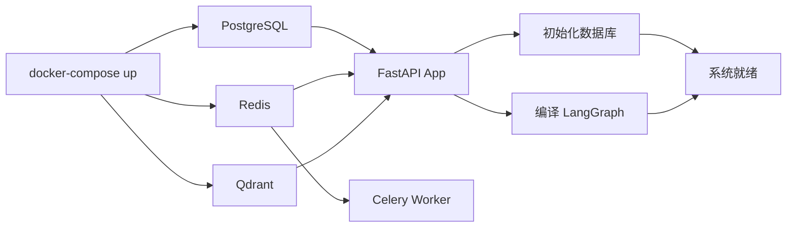

## 9. 代码质量与 CI

| 工具 | 用途 | 配置位置 |
|---|---|---|
| ruff | Lint + Format | `.pre-commit-config.yaml`, `pyproject.toml` |
| ty | 类型检查 | `.pre-commit-config.yaml` |
| pytest | 单元/集成测试 | `pyproject.toml` |
| GitHub Actions | CI 流水线 | `.github/workflows/ci.yml` |

CI 流程：
1. 检出代码
2. 设置 Python 3.12 + uv 0.6.5
3. 创建 test database
4. Cache uv dependencies (`actions/cache@v4`)
5. `uv sync` 安装依赖
6. `uv run ruff check app tests`
7. `uv run pytest --cov=app --cov-fail-under=75`
