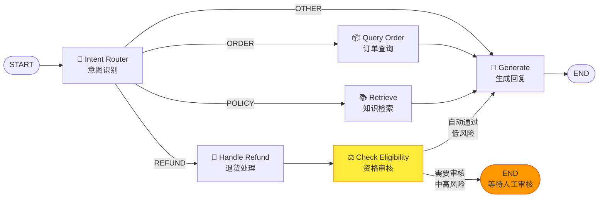
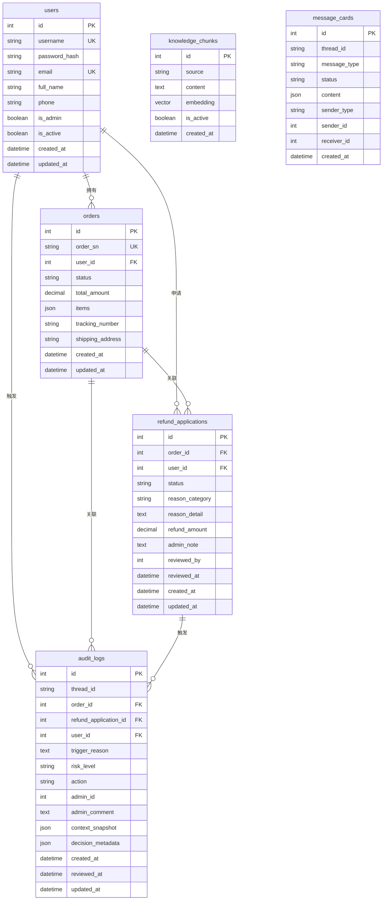
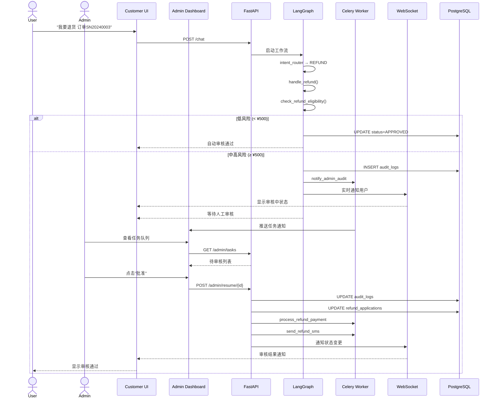
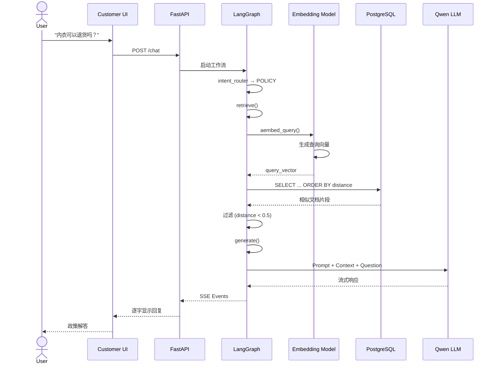
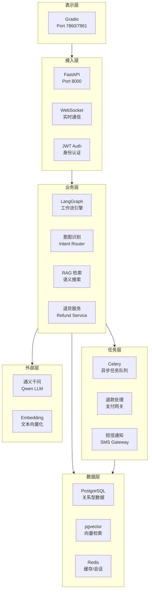
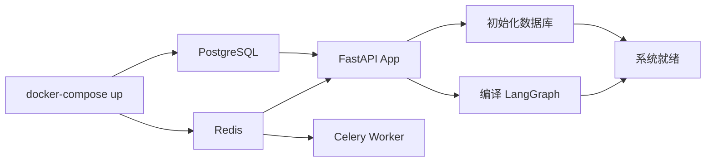

# E-commerce Smart Agent v4.0 系统架构图

## 1. 整体架构图

```mermaid
flowchart TB
    subgraph Frontend["🖥️ 前端层 (Gradio)"]
        CUI["👤 Customer UI<br/>用户聊天界面<br/>Port: 7860"]
        ADM["🛡️ Admin Dashboard<br/>管理员工作台<br/>Port: 7861"]
    end

    subgraph APILayer["📡 API 层 (FastAPI)"]
        API["FastAPI Application<br/>Port: 8000"]

        subgraph Routers["🔀 路由模块"]
            AUTH["/auth<br/>登录认证"]
            CHAT["/chat<br/>聊天接口 (SSE)"]
            WS["/ws<br/>WebSocket"]
            ADMIN["/admin<br/>管理员 API"]
            STATUS["/status<br/>状态查询"]
        end
    end

    subgraph CoreLayer["⚙️ 核心层"]
        CONFIG["Config<br/>Pydantic Settings"]
        DB["Database<br/>SQLModel + AsyncPG"]
        SEC["Security<br/>JWT Auth"]
    end

    subgraph AgentLayer["🤖 Agent 层 (LangGraph)"]
        GRAPH["StateGraph<br/>工作流编排"]

        subgraph Nodes["📍 节点定义"]
            INTENT["Intent Router<br/>意图识别"]
            RETRIEVE["Retrieve<br/>知识检索 (RAG)"]
            QUERY["Query Order<br/>订单查询"]
            REFUND["Handle Refund<br/>退货处理"]
            AUDIT["Check Eligibility<br/>资格审核"]
            GEN["Generate<br/>回复生成"]
        end

        subgraph State["📦 状态定义"]
            AGENT_STATE["AgentState<br/>TypedDict"]
        end
    end

    subgraph ServiceLayer["🛠️ 服务层"]
        REFUND_SVC["Refund Service<br/>退货业务逻辑"]
        RULES["Refund Rules<br/>退货规则引擎"]
    end

    subgraph TaskLayer["⏳ 任务层 (Celery)"]
        CELERY["Celery Worker<br/>异步任务队列"]
        TASKS["Refund Tasks<br/>- 发送短信<br/>- 处理退款<br/>- 通知管理员"]
    end

    subgraph WebSocketLayer["🔌 WebSocket 层"]
        WS_MGR["Connection Manager<br/>连接管理器"]
    end

    subgraph DataLayer["💾 数据层"]
        subgraph PostgreSQL["🐘 PostgreSQL + pgvector"]
            TBL_USERS[(users<br/>用户表)]
            TBL_ORDERS[(orders<br/>订单表)]
            TBL_REFUNDS[(refund_applications<br/>退款申请表)]
            TBL_AUDIT[(audit_logs<br/>审计日志表)]
            TBL_KNOWLEDGE[(knowledge_chunks<br/>知识库表)]
            TBL_MSG[(message_cards<br/>消息卡片表)]
        end

        subgraph Redis["🔴 Redis"]
            REDIS_CACHE["Session Cache<br/>状态缓存"]
            REDIS_CELERY["Celery Broker<br/>任务队列"]
            REDIS_CHECK["LangGraph Checkpoint<br/>检查点"]
        end
    end

    subgraph External["🌐 外部服务"]
        LLM["LLM API<br/>通义千问/Qwen"]
        EMBED["Embedding API<br/>文本嵌入"]
    end

    %% 连接关系
    CUI <-->|"HTTP/SSE"| API
    ADM <-->|"HTTP"| API

    API --> Routers
    Routers --> CoreLayer
    Routers --> AgentLayer
    Routers --> ServiceLayer
    Routers --> WebSocketLayer

    CHAT --> GRAPH
    ADMIN --> REFUND_SVC
    WS --> WS_MGR

    GRAPH --> Nodes
    Nodes --> State
    INTENT --> RETRIEVE & QUERY & REFUND
    REFUND --> AUDIT
    QUERY --> GEN
    RETRIEVE --> GEN
    AUDIT --> GEN

    REFUND_SVC --> RULES
    REFUND_SVC --> DB

    AUDIT -->|"高风险触发"| CELERY
    CELERY --> TASKS
    TASKS --> DB

    Nodes <-->|"Embedding/LLM"| External

    DB --> PostgreSQL
    WS_MGR --> REDIS_CACHE
    CELERY --> REDIS_CELERY
    GRAPH --> REDIS_CHECK
```



## 2. LangGraph 工作流详解



## 3. 数据模型关系图



## 4. 系统交互流程图

### 4.1 订单查询流程


### 4.2 退货申请 + 风控审核流程



### 4.3 政策咨询 (RAG) 流程



## 5. 技术栈分层



## 6. 项目文件结构

```
E-commerce-Smart-Agent/
├── 📄 README.md                    # 项目文档
├── 📄 pyproject.toml               # Python 项目配置 (uv)
├── 📄 docker-compose.yaml          # 容器编排配置
├── 📄 celery_worker.py             # Celery Worker 启动脚本
│
├── 📁 app/                         # 主应用目录
│   ├── 📄 main.py                  # FastAPI 应用入口
│   ├── 📄 celery_app.py            # Celery 配置
│   │
│   ├── 📁 api/v1/                  # API 路由层
│   │   ├── 📄 auth.py              # 认证接口 (登录)
│   │   ├── 📄 chat.py              # 聊天接口 (SSE 流式)
│   │   ├── 📄 admin.py             # 管理员接口
│   │   ├── 📄 status.py            # 状态查询接口
│   │   ├── 📄 websocket.py         # WebSocket 端点
│   │   └── 📄 schemas.py           # Pydantic 数据模型
│   │
│   ├── 📁 core/                    # 核心基础设施
│   │   ├── 📄 config.py            # 配置管理 (Pydantic Settings)
│   │   ├── 📄 database.py          # 数据库连接 (SQLModel)
│   │   └── 📄 security.py          # JWT 认证
│   │
│   ├── 📁 models/                  # 数据库模型 (SQLModel)
│   │   ├── 📄 user.py              # 用户表
│   │   ├── 📄 order.py             # 订单表
│   │   ├── 📄 refund.py            # 退款申请表
│   │   ├── 📄 audit.py             # 审计日志表
│   │   ├── 📄 knowledge.py         # 知识库表
│   │   └── 📄 message.py           # 消息卡片表
│   │
│   ├── 📁 graph/                   # LangGraph 核心逻辑
│   │   ├── 📄 workflow.py          # 工作流定义与编译
│   │   ├── 📄 state.py             # 状态定义 (TypedDict)
│   │   ├── 📄 nodes.py             # 节点函数 (6个节点)
│   │   └── 📄 tools.py             # 工具函数 (3个工具)
│   │
│   ├── 📁 services/                # 业务服务层
│   │   └── 📄 refund_service.py    # 退货业务逻辑
│   │
│   ├── 📁 tasks/                   # Celery 异步任务
│   │   └── 📄 refund_tasks.py      # 退款相关任务
│   │
│   ├── 📁 websocket/               # WebSocket 服务
│   │   └── 📄 manager.py           # 连接管理器
│   │
│   └── 📁 frontend/                # Gradio 前端界面
│       ├── 📄 customer_ui.py       # C端用户界面 (Port 7860)
│       └── 📄 admin_dashboard.py   # B端管理后台 (Port 7861)
│
├── 📁 scripts/                     # 辅助脚本
│   ├── 📄 seed_data.py             # 数据库初始化数据
│   ├── 📄 seed_large_data.py       # 大批量测试数据
│   ├── 📄 etl_policy.py            # 知识库 ETL (PDF/Markdown)
│   └── 📄 verify_db.py             # 数据库验证脚本
│
├── 📁 migrations/                  # Alembic 数据库迁移
│   ├── 📄 env.py
│   └── 📁 versions/
│       └── 📄 *.py                 # 迁移脚本
│
├── 📁 data/                        # 静态数据
│   └── 📄 shipping_policy.md       # 示例政策文档
│
└── 📁 test/                        # 测试文件
    └── 📄 test_*.py                # 单元测试/集成测试
```

## 7. 核心特性

| 特性 | 描述 | 技术实现 |
|------|------|----------|
| **智能问答** | 基于 LLM 的订单查询和政策咨询 | LangChain + LangGraph |
| **意图识别** | 自动识别用户意图 (ORDER/POLICY/REFUND/OTHER) | LLM Prompt |
| **RAG 检索** | 基于 pgvector 的语义知识检索 | Embedding + 向量数据库 |
| **退货流程** | 多步骤退货申请流程 | LangGraph 状态机 |
| **智能风控** | 按金额分级风控 (¥500/¥2000 阈值) | 规则引擎 |
| **人工审核** | 高风险订单转人工审核 | 审计日志 + 管理后台 |
| **实时通知** | WebSocket 状态同步 | ConnectionManager |
| **异步任务** | 退款支付、短信通知异步处理 | Celery + Redis |
| **多租户隔离** | 用户只能访问自己的订单 | JWT + 数据库查询过滤 |

## 8. 启动流程


