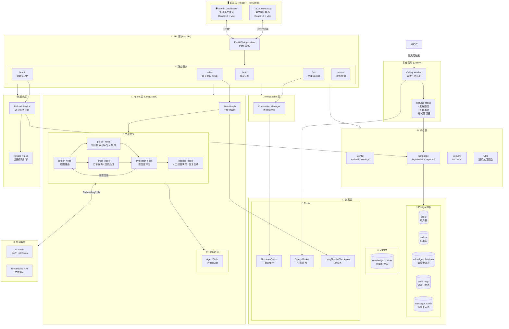
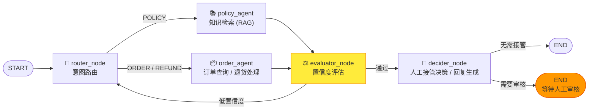
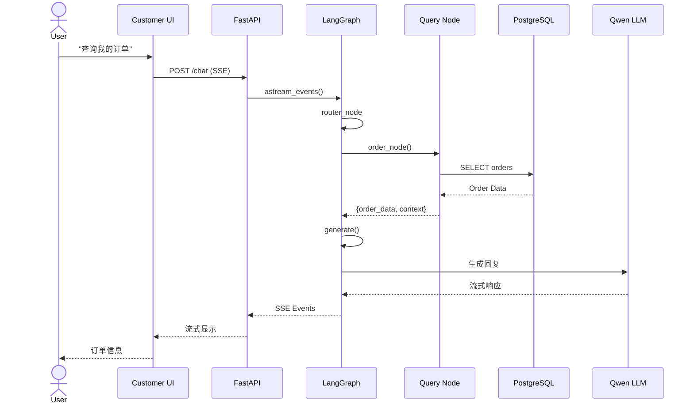
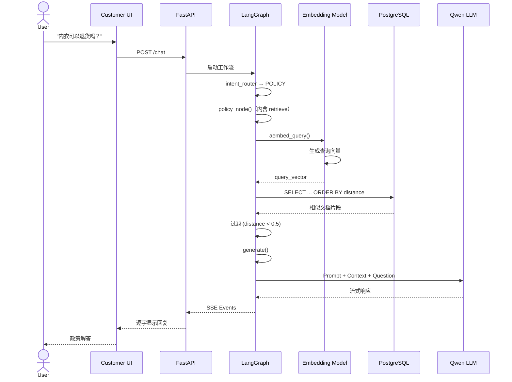
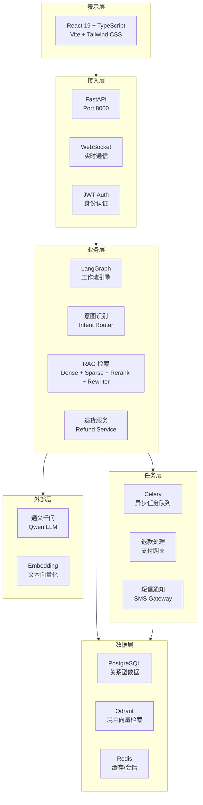
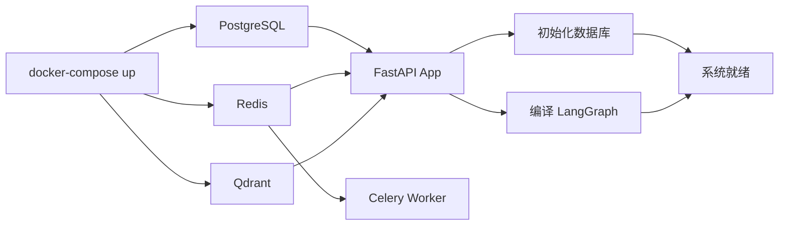

# E-commerce Smart Agent v4.1 系统架构图

## 1. 整体架构图



## 2. LangGraph 工作流详解



## 3. 数据模型关系图

```mermaid
erDiagram
    users ||--o{ orders : "拥有"
    users ||--o{ refund_applications : "申请"
    users ||--o{ audit_logs : "触发"
    orders ||--o{ refund_applications : "关联"
    orders ||--o{ audit_logs : "关联"
    refund_applications ||--o{ audit_logs : "触发"

    users {
        int id PK
        string username UK
        string password_hash
        string email UK
        string full_name
        string phone
        boolean is_admin
        boolean is_active
        datetime created_at
        datetime updated_at
    }

    orders {
        int id PK
        string order_sn UK
        int user_id FK
        string status
        decimal total_amount
        json items
        string tracking_number
        string shipping_address
        datetime created_at
        datetime updated_at
    }

    refund_applications {
        int id PK
        int order_id FK
        int user_id FK
        string status
        string reason_category
        text reason_detail
        decimal refund_amount
        text admin_note
        int reviewed_by
        datetime reviewed_at
        datetime created_at
        datetime updated_at
    }

    audit_logs {
        int id PK
        string thread_id
        int order_id FK
        int refund_application_id FK
        int user_id FK
        text trigger_reason
        string risk_level
        string audit_level
        string trigger_type
        string action
        int admin_id
        text admin_comment
        json context_snapshot
        json decision_metadata
        json confidence_metadata
        datetime created_at
        datetime reviewed_at
        datetime updated_at
    }

    message_cards {
        int id PK
        string thread_id
        string message_type
        string status
        json content
        json meta_data
        string sender_type
        int sender_id
        int receiver_id
        datetime created_at
    }

    knowledge_chunks[Qdrant Collection: knowledge_chunks] {
        string source
        text content
        vector embedding
        boolean is_active
        datetime created_at
    }
```

## 4. 系统交互流程图

### 4.1 订单查询流程



### 4.2 退货申请 + 风控审核流程


### 4.3 政策咨询 (RAG) 流程



## 5. 技术栈分层



## 6. 项目文件结构

```
E-commerce-Smart-Agent/
├── 📄 README.md                    # 项目文档
├── 📄 .env.example                 # 环境变量模板
├── 📄 pyproject.toml               # Python 项目配置 (uv)
├── 📄 docker-compose.yaml          # 容器编排配置
├── 📄 celery_worker.py             # Celery Worker 启动脚本
│
├── 📁 app/                         # 主应用目录
│   ├── 📄 main.py                  # FastAPI 应用入口
│   ├── 📄 celery_app.py            # Celery 配置
│   │
│   ├── 📁 api/v1/                  # API 路由层
│   │   ├── 📄 auth.py              # 认证接口 (登录)
│   │   ├── 📄 chat.py              # 聊天接口 (SSE 流式)
│   │   ├── 📄 chat_utils.py        # SSE 流式响应工具
│   │   ├── 📄 admin.py             # 管理员接口
│   │   ├── 📄 status.py            # 状态查询接口
│   │   ├── 📄 websocket.py         # WebSocket 端点
│   │   └── 📄 schemas.py           # Pydantic 数据模型
│   │
│   ├── 📁 core/                    # 核心基础设施
│   │   ├── 📄 config.py            # 配置管理 (Pydantic Settings)
│   │   ├── 📄 database.py          # 数据库连接 (SQLModel)
│   │   ├── 📄 redis.py             # 统一 Redis 客户端
│   │   ├── 📄 security.py          # JWT 认证
│   │   ├── 📄 limiter.py           # API 限流 (slowapi)
│   │   ├── 📄 llm_factory.py       # LLM 实例工厂
│   │   ├── 📄 logging.py           # 结构化日志 (correlation_id)
│   │   └── 📄 utils.py             # 工具函数（utc_now 等）
│   │
│   ├── 📁 models/                  # 数据库模型 (SQLModel)
│   │   ├── 📄 user.py              # 用户表
│   │   ├── 📄 order.py             # 订单表
│   │   ├── 📄 refund.py            # 退款申请表
│   │   ├── 📄 audit.py             # 审计日志表
│   │   ├── 📄 knowledge.py         # 知识库表
│   │   ├── 📄 message.py           # 消息卡片表
│   │   └── 📄 state.py             # AgentState TypedDict
│   │
│   ├── 📁 graph/                   # LangGraph 核心逻辑
│   │   ├── 📄 workflow.py          # 工作流定义与编译
│   │   └── 📄 nodes.py             # router_node / policy_agent / order_agent / evaluator_node / decider_node
│   │
│   ├── 📁 agents/                  # Agent 实现层
│   │   ├── 📄 base.py              # Agent 基类
│   │   ├── 📄 router.py            # IntentRouterAgent
│   │   ├── 📄 order.py             # 订单 Agent
│   │   ├── 📄 policy.py            # 政策 Agent
│   │   └── 📄 evaluator.py         # ConfidenceEvaluator
│   │
│   ├── 📁 confidence/              # 置信度信号模块
│   │   └── 📄 signals.py           # 置信度评估信号计算
│   │
│   ├── 📁 utils/                   # 通用工具函数
│   │   └── 📄 order_utils.py       # 订单相关工具
│   │
│   ├── 📁 intent/                  # 意图识别模块
│   │   ├── 📄 service.py           # IntentRecognitionService (Redis 会话/缓存)
│   │   ├── 📄 models.py            # 意图/槽位/澄清状态数据模型
│   │   ├── 📄 config.py            # 意图识别配置
│   │   ├── 📄 classifier.py        # 意图分类器
│   │   ├── 📄 clarification.py     # 澄清引擎
│   │   ├── 📄 slot_validator.py    # 槽位验证器
│   │   ├── 📄 topic_switch.py      # 话题切换检测
│   │   ├── 📄 multi_intent.py      # 多意图处理器
│   │   └── 📄 safety.py            # 安全过滤器
│   │
│   ├── 📁 retrieval/               # RAG 检索层
│   │   ├── 📄 client.py            # 检索客户端
│   │   ├── 📄 embeddings.py        # 向量嵌入
│   │   ├── 📄 retriever.py         # 检索器
│   │   ├── 📄 reranker.py          # 精排器
│   │   ├── 📄 rewriter.py          # 查询重写器
│   │   └── 📄 sparse_embedder.py   # 稀疏嵌入
│   │
│   ├── 📁 services/                # 业务服务层
│   │   ├── 📄 refund_service.py    # 退货业务逻辑
│   │   ├── 📄 refund_tool_service.py # 退款工具服务
│   │   ├── 📄 status_service.py    # 状态服务
│   │   ├── 📄 order_service.py     # 订单服务
│   │   ├── 📄 admin_service.py     # 管理员服务
│   │   └── 📄 auth_service.py      # 认证服务
│   │
│   ├── 📁 schemas/                 # 共享 Schema
│   │   ├── 📄 auth.py
│   │   ├── 📄 admin.py
│   │   └── 📄 status.py
│   │
│   ├── 📁 tasks/                   # Celery 异步任务
│   │   └── 📄 refund_tasks.py      # 退款相关任务
│   │
│   ├── 📁 websocket/               # WebSocket 服务
│   │   └── 📄 manager.py           # 连接管理器
│   │
│
├── 📁 frontend/                    # React 前端 (Vite + TypeScript)
│   ├── 📄 package.json             # npm 依赖配置
│   ├── 📄 vite.config.ts           # Vite 多页面配置
│   ├── 📄 tailwind.config.ts       # Tailwind CSS 配置
│   ├── 📄 tsconfig.json            # TypeScript 配置
│   ├── 📄 index.html               # C端入口
│   ├── 📄 admin.html               # B端入口
│   │
│   └── 📁 src/
│       ├── 📁 apps/
│       │   ├── 📁 customer/        # C端用户应用
│       │   │   ├── 📄 App.tsx
│       │   │   ├── 📄 main.tsx
│       │   │   ├── 📁 pages/
│       │   │   │   ├── 📄 Login.tsx
│       │   │   │   └── 📄 Chat.tsx
│       │   │   ├── 📁 hooks/
│       │   │   │   └── 📄 useChat.ts
│       │   │   └── 📁 components/
│       │   │       ├── 📄 ChatMessageList.tsx
│       │   │       └── 📄 ChatInput.tsx
│       │   │
│       │   └── 📁 admin/           # B端管理后台
│       │       ├── 📄 App.tsx
│       │       ├── 📄 main.tsx
│       │       └── 📁 pages/
│       │           ├── 📄 Login.tsx
│       │           └── 📄 Dashboard.tsx
│       │
│       ├── 📁 components/
│       │   ├── 📁 ui/              # shadcn/ui 组件
│       │   │   ├── 📄 accordion.tsx
│       │   │   ├── 📄 alert.tsx
│       │   │   ├── 📄 avatar.tsx
│       │   │   ├── 📄 badge.tsx
│       │   │   ├── 📄 button.tsx
│       │   │   ├── 📄 card.tsx
│       │   │   ├── 📄 input.tsx
│       │   │   ├── 📄 label.tsx
│       │   │   ├── 📄 radio-group.tsx
│       │   │   ├── 📄 scroll-area.tsx
│       │   │   ├── 📄 separator.tsx
│       │   │   ├── 📄 sheet.tsx
│       │   │   ├── 📄 skeleton.tsx
│       │   │   └── 📄 textarea.tsx
│       │   └── 📁 common/          # 业务共享组件
│       │
│       ├── 📁 lib/                 # 共享基础设施
│       │   ├── 📄 api.ts           # 统一 API 客户端
│       │   ├── 📄 risk.ts          # 风险等级配置
│       │   ├── 📄 query-client.ts  # Query Client 配置
│       │   └── 📄 utils.ts         # 前端工具函数
│       ├── 📁 stores/              # Zustand 状态管理
│       │   └── 📄 auth.ts          # 认证状态
│       ├── 📁 hooks/               # 自定义 React Hooks
│       │   ├── 📄 useAuth.ts
│       │   ├── 📄 useNotifications.ts
│       │   └── 📄 useTasks.ts
│       ├── 📁 types/               # TypeScript 类型定义
│       │   └── 📄 index.ts         # 统一类型导出
│
├── 📄 start.sh                     # 本地一键启动脚本
├── 📄 start_worker.sh              # 单独启动 Celery Worker
├── 📄 alembic.ini                  # Alembic 迁移配置
│
├── 📁 scripts/                     # 辅助脚本
│   ├── 📄 seed_data.py             # 数据库初始化数据
│   ├── 📄 seed_large_data.py       # 大批量测试数据
│   ├── 📄 etl_qdrant.py            # 知识库 ETL (PDF/Markdown → Qdrant)
│   └── 📄 verify_db.py             # 数据库验证脚本
│
├── 📁 migrations/                  # Alembic 数据库迁移
│   ├── 📄 env.py
│   └── 📁 versions/
│       └── 📄 *.py                 # 迁移脚本
│
├── 📁 data/                        # 静态数据
│   └── 📄 shipping_policy.md       # 示例政策文档
│
└── 📁 tests/                       # 测试文件
    ├── 📄 conftest.py              # pytest 全局 fixtures
    ├── 📄 _db_config.py            # 测试数据库配置
    ├── 📄 test_auth_api.py         # 认证 API 测试
    ├── 📄 test_chat_api.py         # 聊天 API 测试
    ├── 📄 test_admin_api.py        # 管理员 API 测试
    ├── 📄 test_websocket.py        # WebSocket 测试
    ├── 📄 test_confidence_signals.py # 置信度信号测试
    ├── 📄 test_refund_tasks.py     # 退款任务测试
    ├── 📁 agents/                  # Agent 单元测试
    ├── 📁 graph/                   # LangGraph 测试
    ├── 📁 intent/                  # 意图模块测试
    ├── 📁 retrieval/               # RAG 检索测试
    └── 📁 integration/             # 集成测试
```

## 7. 核心特性

| 特性 | 描述 | 技术实现 |
|------|------|----------|
| **智能问答** | 基于 LLM 的订单查询和政策咨询 | LangChain + LangGraph |
| **LangGraph 节点编排** | router_node → policy_agent/order_agent → evaluator_node → decider_node 显式工作流 | LangGraph 1.0+ Command API |
| **意图识别** | 分层意图识别（一级业务域 / 二级动作 / 三级子意图）+ 槽位提取与澄清机制 | IntentRecognitionService + Redis |
| **RAG 检索** | 基于 Qdrant 的混合语义检索（Dense + BM25 Sparse + Rerank） | Embedding + 向量数据库 |
| **查询重写与精排** | RAG 流程中先重写查询，再混合检索，最后 Rerank | `retrieval/` 模块 |
| **API 限流** | 防止暴力破解和滥用 | `slowapi` |
| **结构化日志** | 全链路 correlation_id 追踪 | `app/core/logging.py` |
| **pre-commit 质量门禁** | 提交前自动格式化、类型检查 | `ruff` + `ty` |
| **退货流程** | 多步骤退货申请流程 | LangGraph 状态机 |
| **智能风控** | 按金额分级风控 (¥500/¥2000 阈值) | 规则引擎 |
| **人工审核** | 高风险订单转人工审核 | 审计日志 + 管理后台 |
| **实时通知** | WebSocket 状态同步 | ConnectionManager |
| **异步任务** | 退款支付、短信通知异步处理 | Celery + Redis |
| **多租户隔离** | 用户只能访问自己的订单 | JWT + 数据库查询过滤 |

## 8. 启动流程



## 9. 代码质量与 CI

| 工具 | 用途 | 配置位置 |
|---|---|---|
| ruff | Lint + Format | `.pre-commit-config.yaml`, `pyproject.toml` |
| ty | 类型检查 | `.pre-commit-config.yaml` |
| pytest | 单元/集成测试 | `pyproject.toml` |
| GitHub Actions | CI 流水线 | `.github/workflows/ci.yml` |

CI 流程：
1. 检出代码
2. 设置 Python 3.12 + uv 0.6.5
3. 创建 test database
4. Cache uv dependencies (`actions/cache@v4`)
5. `uv sync` 安装依赖
6. `uv run ruff check app tests`
7. `uv run pytest --cov=app --cov-fail-under=75`
