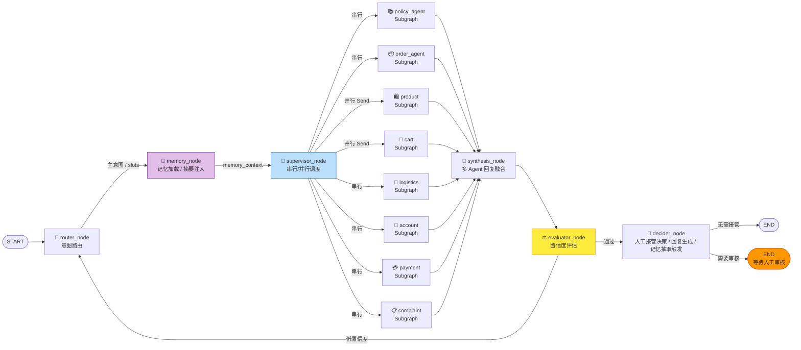

# LangGraph 工作流详解

当前 Agent 层采用 **Supervisor-based Graph** 编排方式，并在工作流中嵌入 **记忆层** (`memory_node`)，实现长期上下文增强：

- `router_node` 负责意图识别与澄清，将结果写入 `AgentState`。
- `memory_node` 加载结构化记忆（`UserProfile`、`UserPreference`、`UserFact`、`InteractionSummary`）和向量对话记忆（`conversation_memory` 语义检索），生成 `memory_context` 并注入后续 Agent Prompt。
- `supervisor_node` 基于 `intent_result` 中的主意图和 `pending_intents`，通过 `plan_dispatch` 判断多个意图之间是否独立，决定**串行**或**并行**调度。
- 若为并行，通过 `build_parallel_sends` 生成多个 `LangGraph Send`，同时分发到不同的 `Agent Subgraph`。
- 各 `Agent Subgraph` 执行完毕后统一收敛到 `synthesis_node`，将多个专家回复融合为一段连贯回答。
- 之后进入 `evaluator_node` 进行置信度评估，低置信度时回到 `router_node` 重试。
- `decider_node` 在最终决策（人工接管/直接回复）后，触发 Celery 异步任务进行会话摘要与事实抽取。

