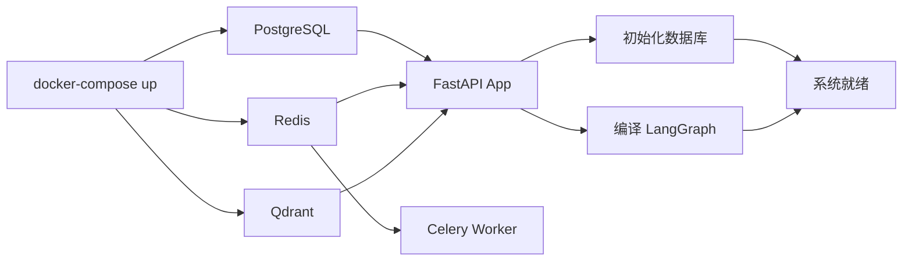

# 启动流程

## 启动步骤

1. **启动基础设施**：`docker compose up -d db redis qdrant`
2. **数据库迁移**：`uv run alembic upgrade head`
3. **启动 FastAPI**：`uv run uvicorn app.main:app --reload`
4. **启动 Celery Worker**：`uv run celery -A app.celery_app worker --loglevel=info --concurrency=4 --pool=solo --beat`
5. **系统就绪**：访问 `http://localhost:8000/health` 验证

> 一键启动脚本 `./start.sh` 已封装以上步骤。
