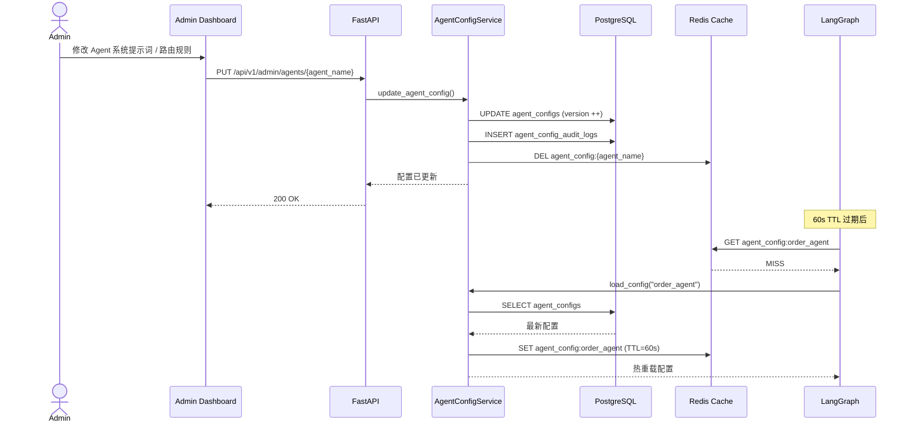

# Agent 配置中心流程

```mermaid
sequenceDiagram
    actor Admin
    participant ADM as Admin Dashboard
    participant API as FastAPI
    participant Svc as AgentConfigService
    participant DB as PostgreSQL
    participant Cache as Redis Cache
    participant Graph as LangGraph

    Admin->>ADM: 修改 Agent 系统提示词 / 路由规则
    ADM->>API: PUT /api/v1/admin/agents/{agent_name}
    API->>Svc: update_agent_config()
    Svc->>DB: UPDATE agent_configs (version ++)
    Svc->>DB: INSERT agent_config_audit_logs
    Svc->>Cache: DEL agent_config:{agent_name}
    Svc-->>API: 配置已更新
    API-->>ADM: 200 OK

    Note over Graph: 60s TTL 过期后
    Graph->>Cache: GET agent_config:order_agent
    Cache-->>Graph: MISS
    Graph->>Svc: load_config("order_agent")
    Svc->>DB: SELECT agent_configs
    DB-->>Svc: 最新配置
    Svc->>Cache: SET agent_config:order_agent (TTL=60s)
    Svc-->>Graph: 热重载配置
```
