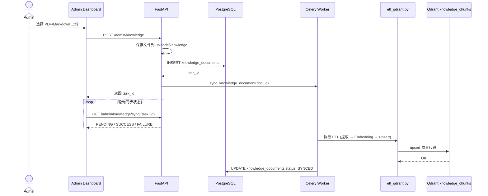

# B 端知识库上传与同步流程

```mermaid
sequenceDiagram
    actor Admin
    participant ADM as Admin Dashboard
    participant API as FastAPI
    participant DB as PostgreSQL
    participant Celery as Celery Worker
    participant ETL as etl_qdrant.py
    participant VecDB as Qdrant knowledge_chunks

    Admin->>ADM: 选择 PDF/Markdown 上传
    ADM->>API: POST /admin/knowledge
    API->>API: 保存文件到 uploads/knowledge
    API->>DB: INSERT knowledge_documents
    DB-->>API: doc_id
    API->>Celery: sync_knowledge_document(doc_id)
    API-->>ADM: 返回 task_id

    loop 轮询同步状态
        ADM->>API: GET /admin/knowledge/sync/{task_id}
        API-->>ADM: PENDING / SUCCESS / FAILURE
    end

    Celery->>ETL: 执行 ETL (提取 → Embedding → Upsert)
    ETL->>VecDB: upsert 向量片段
    VecDB-->>ETL: OK
    Celery->>DB: UPDATE knowledge_documents.status=SYNCED
```
