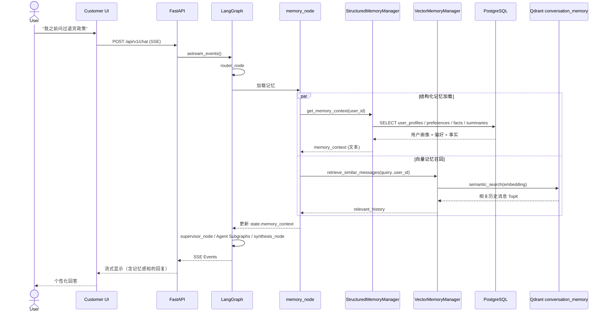

# 记忆系统加载流程

```mermaid
sequenceDiagram
    actor User
    participant CUI as Customer UI
    participant API as FastAPI
    participant Graph as LangGraph
    participant MemoryNode as memory_node
    participant StructMgr as StructuredMemoryManager
    participant VecMgr as VectorMemoryManager
    participant PG as PostgreSQL
    participant Qdrant as Qdrant conversation_memory

    User->>CUI: "我之前问过退货政策"
    CUI->>API: POST /api/v1/chat (SSE)
    API->>Graph: astream_events()
    Graph->>Graph: router_node
    Graph->>MemoryNode: 加载记忆

    par 结构化记忆加载
        MemoryNode->>StructMgr: get_memory_context(user_id)
        StructMgr->>PG: SELECT user_profiles / preferences / facts / summaries
        PG-->>StructMgr: 用户画像 + 偏好 + 事实
        StructMgr-->>MemoryNode: memory_context (文本)
    and 向量记忆召回
        MemoryNode->>VecMgr: retrieve_similar_messages(query, user_id)
        VecMgr->>Qdrant: semantic_search(embedding)
        Qdrant-->>VecMgr: 相关历史消息 TopK
        VecMgr-->>MemoryNode: relevant_history
    end

    MemoryNode-->>Graph: 更新 state.memory_context
    Graph->>Graph: supervisor_node / Agent Subgraphs / synthesis_node
    Graph-->>API: SSE Events
    API-->>CUI: 流式显示（含记忆感知的回复）
    CUI-->>User: 个性化回答
```
