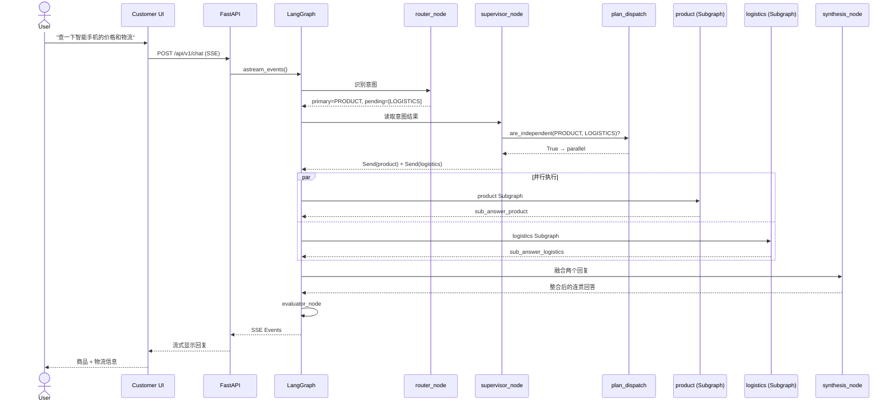

# 并行多意图执行流程

```mermaid
sequenceDiagram
    actor User
    participant CUI as Customer UI
    participant API as FastAPI
    participant Graph as LangGraph
    participant Router as router_node
    participant Supervisor as supervisor_node
    participant Plan as plan_dispatch
    participant Product as product (Subgraph)
    participant Logistics as logistics (Subgraph)
    participant Synthesis as synthesis_node

    User->>CUI: "查一下智能手机的价格和物流"
    CUI->>API: POST /api/v1/chat (SSE)
    API->>Graph: astream_events()
    Graph->>Router: 识别意图
    Router-->>Graph: primary=PRODUCT, pending=[LOGISTICS]
    Graph->>Supervisor: 读取意图结果
    Supervisor->>Plan: are_independent(PRODUCT, LOGISTICS)?
    Plan-->>Supervisor: True → parallel
    Supervisor-->>Graph: Send(product) + Send(logistics)
    par 并行执行
        Graph->>Product: product Subgraph
        Product-->>Graph: sub_answer_product
    and
        Graph->>Logistics: logistics Subgraph
        Logistics-->>Graph: sub_answer_logistics
    end
    Graph->>Synthesis: 融合两个回复
    Synthesis-->>Graph: 整合后的连贯回答
    Graph->>Graph: evaluator_node
    Graph-->>API: SSE Events
    API-->>CUI: 流式显示回复
    CUI-->>User: 商品 + 物流信息
```
