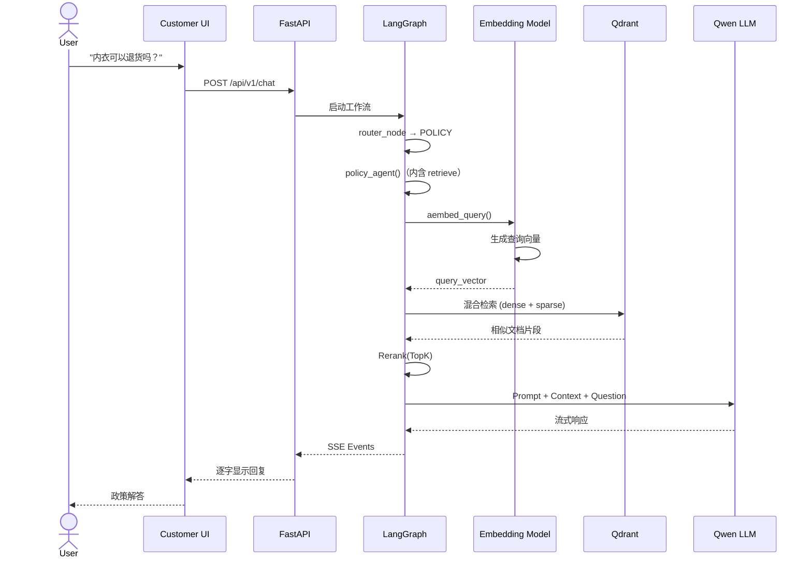

# 政策咨询 (RAG) 流程

```mermaid
sequenceDiagram
    actor User
    participant CUI as Customer UI
    participant API as FastAPI
    participant Graph as LangGraph
    participant Embed as Embedding Model
    participant VecDB as Qdrant
    participant LLM as Qwen LLM

    User->>CUI: "内衣可以退货吗？"
    CUI->>API: POST /api/v1/chat
    API->>Graph: 启动工作流
    Graph->>Graph: router_node → POLICY
    Graph->>Graph: policy_agent()（内含 retrieve）
    Graph->>Embed: aembed_query()
    Embed->>Embed: 生成查询向量
    Embed-->>Graph: query_vector
    Graph->>VecDB: 混合检索 (dense + sparse)
    VecDB-->>Graph: 相似文档片段
    Graph->>Graph: Rerank(TopK)
    Graph->>LLM: Prompt + Context + Question
    LLM-->>Graph: 流式响应
    Graph-->>API: SSE Events
    API-->>CUI: 逐字显示回复
    CUI-->>User: 政策解答
```
