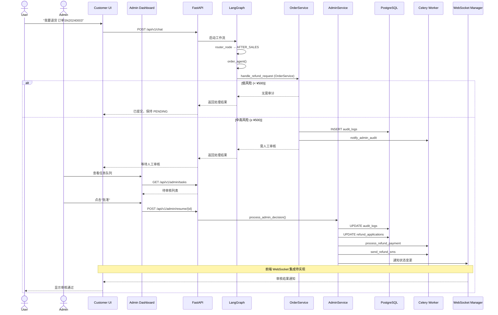

# 退货申请 + 风控审核流程

```mermaid
sequenceDiagram
    actor User
    actor Admin
    participant CUI as Customer UI
    participant ADM as Admin Dashboard
    participant API as FastAPI
    participant Graph as LangGraph
    participant Service as OrderService
    participant AdminSvc as AdminService
    participant DB as PostgreSQL
    participant Celery as Celery Worker
    participant WS as WebSocket Manager

    User->>CUI: "我要退货 订单SN20240003"
    CUI->>API: POST /api/v1/chat
    API->>Graph: 启动工作流
    Graph->>Graph: router_node → AFTER_SALES
    Graph->>Graph: order_agent()
    Graph->>Service: handle_refund_request (OrderService)

    alt 低风险 (< ¥500)
        Service-->>Graph: 无需审计
        Graph-->>API: 返回处理结果
        API-->>CUI: 已提交，保持 PENDING
    else 中高风险 (≥ ¥500)
        Service->>DB: INSERT audit_logs
        Service->>Celery: notify_admin_audit
        Service-->>Graph: 需人工审核
        Graph-->>API: 返回处理结果
        API-->>CUI: 等待人工审核

        Admin->>ADM: 查看任务队列
        ADM->>API: GET /api/v1/admin/tasks
        API-->>ADM: 待审核列表

        Admin->>ADM: 点击"批准"
        ADM->>API: POST /api/v1/admin/resume/{id}
        API->>AdminSvc: process_admin_decision()
        AdminSvc->>DB: UPDATE audit_logs
        AdminSvc->>DB: UPDATE refund_applications
        AdminSvc->>Celery: process_refund_payment
        AdminSvc->>Celery: send_refund_sms
        AdminSvc->>WS: 通知状态变更
        Note over WS,CUI: 前端 WebSocket 集成待实现
        WS-->>CUI: 审核结果通知
        CUI-->>User: 显示审核通过
    end
```
