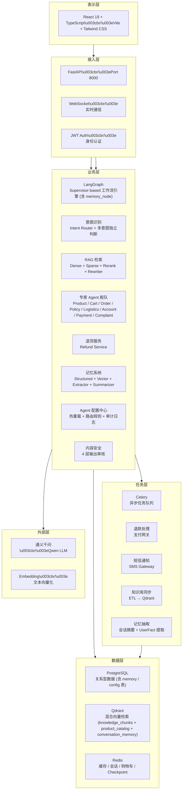

# 技术栈分层

```mermaid
flowchart TB
    subgraph Layer1["表示层"]
        F1["React 19 + TypeScript\u003cbr/\u003eVite + Tailwind CSS"]
    end

    subgraph Layer2["接入层"]
        A1["FastAPI\u003cbr/\u003ePort 8000"]
        A2["WebSocket\u003cbr/\u003e实时通信"]
        A3["JWT Auth\u003cbr/\u003e身份认证"]
    end

    subgraph Layer3["业务层"]
        B1["LangGraph\nSupervisor-based 工作流引擎 (含 memory_node)"]
        B2["意图识别\nIntent Router + 多意图独立判断"]
        B3["RAG 检索\nDense + Sparse + Rerank + Rewriter"]
        B4["专家 Agent 舰队\nProduct / Cart / Order / Policy / Logistics / Account / Payment / Complaint"]
        B5["退货服务\nRefund Service"]
        B6["记忆系统\nStructured + Vector + Extractor + Summarizer"]
        B7["Agent 配置中心\n热重载 + 路由规则 + 审计日志"]
        B8["内容安全\n4 层输出审核"]
    end

    subgraph Layer4["任务层"]
        T1["Celery\n异步任务队列"]
        T2["退款处理\n支付网关"]
        T3["短信通知\nSMS Gateway"]
        T4["知识库同步\nETL → Qdrant"]
        T5["记忆抽取\n会话摘要 + UserFact 提取"]
    end

    subgraph Layer5["数据层"]
        D1["PostgreSQL\n关系型数据 (含 memory / config 表)"]
        D2["Qdrant\n混合向量检索 (knowledge_chunks + product_catalog + conversation_memory)"]
        D3["Redis\n缓存 / 会话 / 购物车 / Checkpoint"]
    end

    subgraph Layer6["外部层"]
        E1["通义千问\u003cbr/\u003eQwen LLM"]
        E2["Embedding\u003cbr/\u003e文本向量化"]
    end

    Layer1 --> Layer2
    Layer2 --> Layer3
    Layer3 --> Layer4
    Layer3 --> Layer5
    Layer4 --> Layer5
    Layer3 --> Layer6
    Layer2 --> Layer3
```

> 各技术的详细说明与版本信息，请参考 [技术栈详情](../../reference/tech-stack-detail.md)。
