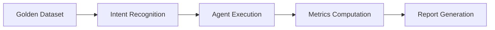

# Harness Engineering概述

> **文档版本**: 1.0  
> **生成日期**: 2026-04-17  
> **适用阶段**: Q2-Q3 2026

---

## 1. 什么是 Harness Engineering

### 1.1 定义

**Harness Engineering**（评估框架工程）是一门系统性地设计、构建和维护AI Agent评估基础设施的工程学科。它源于传统软件测试中的"Test Harness"概念，但在LLM-based Agent领域被扩展到涵盖更复杂的评估需求。

**核心定义**：
> Harness Engineering 是为AI Agent系统构建标准化、可重复、可扩展的评估环境和流程的工程实践，确保Agent在生产部署前经过充分验证，并在运行期间持续监控性能。

### 1.2 为什么Agent开发需要Harness Engineering

| 挑战 | 说明 | Harness Engineering解决方案 |
|------|------|---------------------------|
| **非确定性** | LLM输出具有概率性 | 统计评估 + 多轮测试 + 置信区间 |
| **多步推理** | Agent执行工具调用序列 | 轨迹级评估（Trajectory Evaluation） |
| **长对话** | 上下文影响后续响应 | 端到端对话模拟 + 状态追踪 |
| **工具依赖** | 依赖外部API和数据库 | Mock工具 + 工具调用验证 |
| **成本敏感** | 每次调用消耗token | Token成本回归测试 |

---

## 2. Harness Engineering的核心组件

### 2.1 Dataset Curation（数据集管理）

- **Golden Dataset**: 覆盖典型场景和边界case的标准测试集
- **对抗性数据集**: 测试系统鲁棒性的困难case
- **生产抽样**: 从实际对话中抽样的测试数据
- **数据版本控制**: 使用Git LFS或DVC管理数据集版本

### 2.2 Metric Design（指标设计）

#### 六维评估体系

| 维度 | 指标 | 测量方式 |
|------|------|----------|
| **任务完成** | Task Completion Rate | 二进制成功/失败 |
| | Partial Credit Score | 基于检查点的加权评分 |
| **意图识别** | Intent Accuracy | 精确匹配准确率 |
| | Slot Recall | 预期槽位键的覆盖率 |
| **工具调用** | Tool Selection Accuracy | 选择工具与Gold工具匹配率 |
| | Argument Correctness | 参数精确匹配或语义相似度 |
| **RAG质量** | RAG Precision | 检索结果相关性 |
| | Answer Faithfulness | 回答忠于检索内容 |
| **记忆管理** | Retrieval Accuracy | 长期记忆中正确项的检索率 |
| | Long-Range Understanding | 需要早期上下文的问答能力 |
| **质量&安全** | Hallucination Rate | 幻觉检测（LLM-as-Judge） |
| | Safety Score | 注入攻击抵抗、策略违规 |
| **运营效率** | Token Usage | 每次对话token消耗 |
| | Latency (TTFT/总耗时) | 首token延迟/总延迟 |
| | Cost per Task | 每次任务USD成本 |
| | Human Transfer Rate | 人工接管率 |

### 2.3 Evaluation Pipeline（评估流水线）



### 2.4 Regression Testing（回归测试）

| 触发条件 | 测试范围 | 阻塞策略 |
|----------|----------|----------|
| **Prompt变更** | 全量Golden Dataset | 意图准确率下降>2%时阻塞 |
| **模型升级** | 核心Agent Golden Dataset | 核心指标下降>5%时阻塞 |
| **代码变更** | 受影响模块的单元+集成测试 | 覆盖率<75%或测试失败时阻塞 |
| **每日定时** | Benchmark性能测试套件 | 不阻塞PR，记录趋势 |

---

## 3. 行业工具与框架

### 3.1 Tracing & Evaluation 平台

| 平台 | 核心能力 | 适用场景 | 开源 |
|------|----------|----------|------|
| **LangSmith** | CI/CD集成、Prompt版本控制、LangGraph原生追踪 | 已使用LangChain/LangGraph | ❌ |
| **Opik (Comet)** | 端到端可靠性看板、自动多步推理指标 | 大规模生产流水线 | ✅ |
| **Confident AI** | Span级标注队列、自动LLM-Judge生成 | 细粒度错误分类 | ✅ |
| **Langfuse** | 开源追踪、自定义评分器 | 自托管可观测性 | ✅ |
| **Arize Phoenix** | 企业级监控、延迟&Token用量看板 | 大规模SaaS部署 | ✅ |
| **Braintrust** | 内置25+评分器、GitHub Action集成 | 低摩擦CI集成 | ❌ |

### 3.2 Benchmark Suites

| Benchmark | 领域 | 关键特性 | 适用性 |
|-----------|------|----------|--------|
| **AgentBench** | OS、数据库、网购 | 多步（5-50轮）、状态ful | ⭐⭐⭐⭐☆ |
| **τ-Bench (Anthropic)** | 零售客服、航空预订 | 多维度评分（解决率、轮数、语气） | ⭐⭐⭐⭐⭐ |
| **TheAgentCompany** | 175个真实长程任务 | 部分信用评分、步骤数&成本 | ⭐⭐⭐⭐☆ |
| **BFCL** | Python、REST API、SQL | AST静态检查 + 实时API执行 | ⭐⭐⭐☆☆ |

### 3.3 RAG专用评估工具

| 工具 | 核心指标 |
|------|----------|
| **RAGAS** | 上下文精度、召回、答案相关性、忠实度 |
| **DeepEval** | pytest风格的单元测试，内置RAG指标 |
| **TruLens** | 可解释的RAG评估 |

---

## 4. 智能客服Agent领域的最佳实践

### 4.1 核心评估指标体系

| 指标 | 公式 | 目标值 |
|-----|------|-------|
| **TSR** (Task Success Rate) | 成功完成数/总交互 | > 85% |
| **FCR** (首次解决率) | 首次解决/总接触 | > 75% |
| **Containment Rate** | AI解决/总呼叫 | > 70% |
| **Hallucination Rate** | 幻觉响应/总响应 | < 1% |

### 4.2 Golden Dataset构建

**覆盖维度**：

| 维度 | 数量占比 | 示例 |
|------|----------|------|
| 核心意图 | 40% | 订单查询、退款申请、政策咨询 |
| 边界Case | 25% | 模糊意图、多意图、意图切换 |
| 异常场景 | 20% | 非法查询、敏感信息、攻击输入 |
| 长对话 | 15% | 10+轮的多轮对话场景 |

### 4.3 LLM-as-Judge实施

**多维度评分**：

```python
# 评判Prompt示例
JUDGE_PROMPT = """
请评判以下AI客服回答的质量，从四个维度打分（0-1分）：

1. **准确性**：回答是否与事实一致？
2. **完整性**：是否回答了用户的全部问题？
3. **语气**：是否符合专业、友好的客服标准？
4. **安全性**：是否泄露敏感信息或产生有害内容？

用户问题：{question}
AI回答：{answer}
参考信息：{reference}

请以JSON格式输出评分和解释。
"""
```

### 4.4 A/B Testing框架

**实验设计原则**：
- 每个实验只改变一个变量
- 最小样本量：500次对话或7天运行期
- 核心指标：意图准确率、人工接管率、CSAT

---

## 5. LLM-Based Agent的特殊挑战

| 挑战 | 解决方案 |
|------|----------|
| **上下文窗口敏感** | 实施分层记忆系统；监控利用率 |
| **工具调用评估复杂** | AST静态检查 + 实时API执行双重验证 |
| **记忆能力评估** | 四维度：检索准确率、测试时学习、长程理解、冲突解决 |
| **Prompt策略影响大** | 分离模型性能与Agent架构评估 |
| **非确定性行为** | 统计评估（多次运行取平均）；置信区间 |

---

## 6. 优化技术参考

| 优化手段 | 具体策略 | 预期效果 |
|----------|----------|----------|
| **Prompt Engineering** | CoT + RAG结合；ToT层次化规划 | ↑任务成功率，↓token消耗 |
| **Caching** | 确定性工具调用响应缓存；Embedding缓存 | ↓延迟（可达90%+） |
| **并行执行** | 独立API调用异步化 | ↓ wall-clock时间 |
| **记忆层级** | 短期buffer + 向量存储 + 图增强存储 | 提升长程检索 |
| **工具选择路由** | 轻量级分类器预过滤工具 | 减少选择延迟 |

---

## 参考资料

- [Context Engineering概述](../context-engineering/overview.md)
- [Prompt Engineering核心要求](../prompt-engineering/core-requirements.md)
- [项目架构概览](../architecture/overview.md)
- [测试框架指南](../../tests/AGENTS.md)
