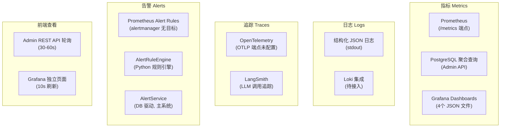
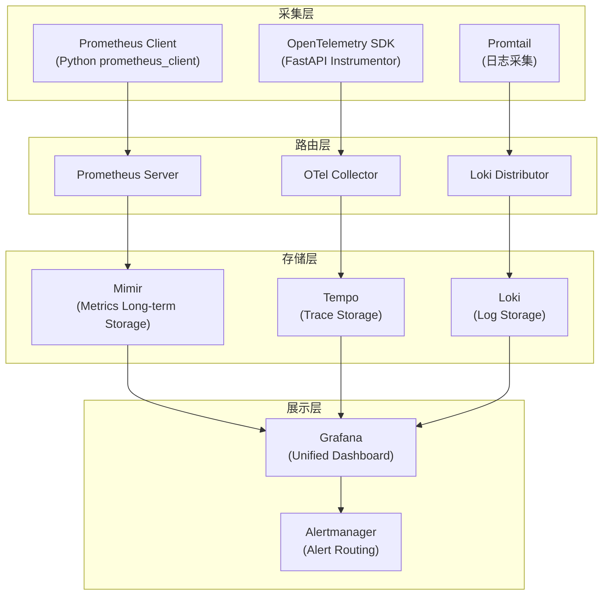
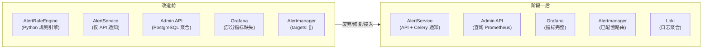
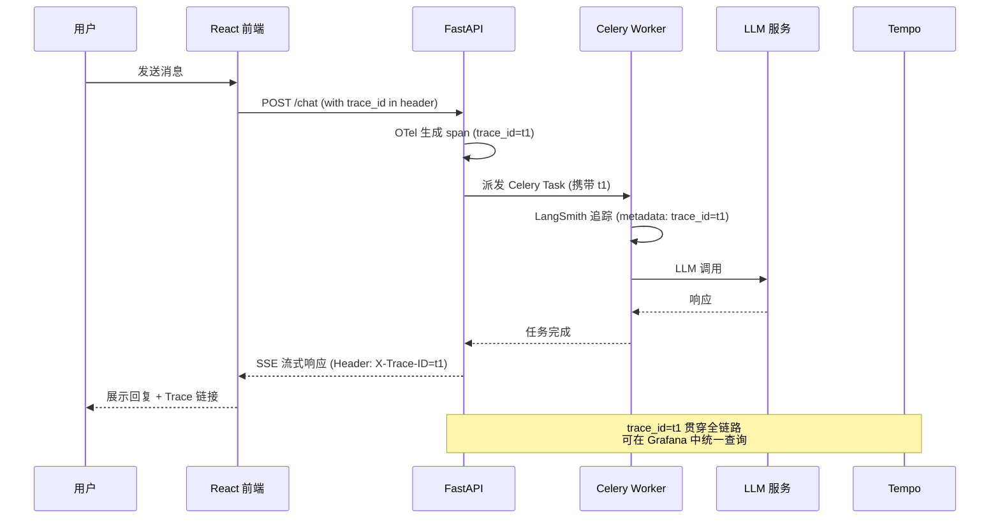
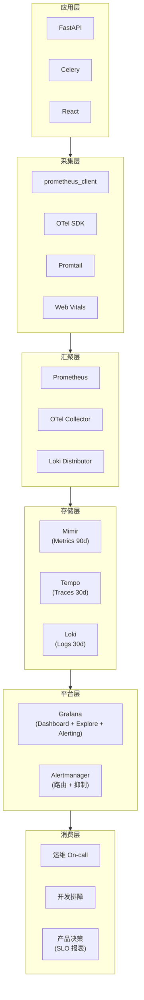

# 统一监控数据改造方案

> **Version**: 1.0
> **日期**: 2026-04-24
> **状态**: 草案

---

## 目录

- [1. 背景与现状分析](#1-背景与现状分析)
- [2. 改造目标与原则](#2-改造目标与原则)
- [3. 企业参考架构](#3-企业参考架构)
- [4. 分阶段改造计划](#4-分阶段改造计划)
- [5. 技术选型对比](#5-技术选型对比)
- [6. 风险评估与回滚策略](#6-风险评估与回滚策略)
- [7. 验收标准](#7-验收标准)

---

## 1. 背景与现状分析

### 1.1 当前监控体系概览

系统已具备一定的可观测性基础设施，但数据分散在多个独立的采集、存储和查看路径中，形成"数据孤岛"。

### 1.2 核心痛点

| 编号 | 痛点 | 影响 | 严重程度 |
|---|---|---|---|
| **P1** | **多重告警机制并存** — Prometheus YAML 规则、`AlertRuleEngine`(Python 规则引擎)、`AlertService`(DB 驱动) 三套机制对相似条件独立评估告警；`AlertManager` 通知模块已废弃但 `AlertRuleEngine` 仍依赖其接口 | 告警规则分散在三处维护，逻辑重复且易冲突 | 高 |
| **P2** | **指标双通道** — Prometheus `/metrics` 与 Admin API `/admin/metrics/dashboard/*` 从同源数据计算相同指标 | 前端与 Grafana 数据不一致、计算资源浪费 | 高 |
| **P3** | **追踪双轨制** — OTel 与 LangSmith 独立运行，无关联 | 无法端到端追踪请求链路 | 中 |
| **P4** | **Grafana Dashboard 存在未定义指标** — `agent_performance.json`、`cost.json`、`security.json` 查询了 11 个未在代码中埋点的指标 | Dashboard 面板无数据 | 高 |
| **P5** | **AlertService 通知渠道未接入 Celery 任务** — `alert_tasks.py` 评估规则后仅写入 DB，未触发 Email/PagerDuty/OpsGenie | 自动化告警通知失效 | 高 |
| **P6** | **日志聚合链路不完整** — 结构化 JSON 日志输出到 stdout，但 Filebeat/Fluentd 接入状态不明 | 日志检索困难 | 中 |
| **P7** | **前端与 Grafana 数据视图分离** — Admin 界面与 Grafana 独立刷新，运维人员需在两个系统间切换 | 查看效率低 | 低 |
| **P8** | **Prometheus alertmanager 目标为空** — `targets: []` 导致 Prometheus 告警触发后无处可发 | Prometheus 告警静默 | 高 |

### 1.3 数据存储现状

| 数据类型 | 存储后端 | 采集方式 | 查看方式 | 保留策略 |
|---|---|---|---|---|
| 指标 (Metrics) | Prometheus TSDB | Pull (`/metrics`) | Grafana | 15天 (默认) |
| 聚合指标 | PostgreSQL | 应用写入 | Admin API / 前端 | 持久化 |
| 日志 (Logs) | stdout | 应用输出 | (待接入 Loki) | 无 |
| 追踪 (Traces) | LangSmith 云端 | SDK 自动上报 | LangSmith Web UI | 30天 |
| OTel 追踪 | (未配置 OTLP) | FastAPI Instrumentor | 无 | 无 |
| 告警事件 | PostgreSQL | Celery 任务写入 | Admin API | 持久化 |
| 执行日志 | PostgreSQL | Celery 异步写入 | Admin API | 持久化 |

---

## 2. 改造目标与原则

### 2.1 总体目标

构建**统一可观测性平台 (Unified Observability Platform)**，实现 metrics、logs、traces、alerts 四类数据的统一采集、统一存储、统一查询、统一告警、统一展示。

### 2.2 设计原则

| 原则 | 说明 |
|---|---|
| **渐进演进** | 不推翻重来，在现有 Prometheus + Grafana 基础上逐步补齐缺口 |
| **单一事实来源** | 每类数据只保留一个主存储，消除双通道 |
| **开源优先** | 以 Grafana LGTM 栈 (Loki + Grafana + Tempo + Mimir) 或 Prometheus 生态为基座，降低 vendor lock-in |
| **自动化优先** | 埋点、采集、告警路由尽量自动化，减少人工配置 |
| **前端一体化** | Admin 界面嵌入 Grafana 面板或使用统一数据源，避免多系统切换 |

### 2.3 目标架构

```mermaid
flowchart LR
    subgraph Sources["数据采集层"]
        S1["FastAPI 应用"]
        S2["Celery Worker"]
        S3["React 前端"]
        S4["PostgreSQL / Redis / Qdrant"]
    end

    subgraph Pipeline["数据管道层"]
        P1["Prometheus<br/>(Metrics)"]
        P2["OpenTelemetry Collector<br/>(Traces + Logs)"]
        P3["Promtail / Fluentd<br/>(Logs)"]
    end

    subgraph Storage["统一存储层"]
        ST1["Mimir / Prometheus<br/>(Metrics)"]
        ST2["Loki<br/>(Logs)"]
        ST3["Tempo<br/>(Traces)"]
    end

    subgraph Platform["统一平台层"]
        G1["Grafana<br/>(Dashboard + Alerting)"]
        G2["Alertmanager<br/>(告警路由)"]
    end

    subgraph Consumers["消费层"]
        C1["运维团队"]
        C2["开发团队"]
        C3["Admin 前端<br/>(嵌入式面板)"]
    end

    Sources --> Pipeline
    Pipeline --> Storage
    Storage --> Platform
    Platform --> Consumers
```

---

## 3. 企业参考架构

### 3.1 主流方案对比

| 方案 | 组成 | 优势 | 劣势 | 适用场景 |
|---|---|---|---|---|
| **Grafana LGTM 栈** | Loki + Grafana + Tempo + Mimir/Prometheus | 开源、统一查询语言 (LogQL/TraceQL/PromQL)、社区活跃、与现有 Prometheus 兼容 | 自建运维成本高、高可用配置复杂 | 有运维能力的中大型团队 |
| **OpenTelemetry + 后端** | OTel Collector + Jaeger + Prometheus + Loki | 厂商无关标准、可插拔后端、 instrumentation 丰富 | 多组件拼装、学习曲线陡峭 | 多语言微服务架构 |
| **Datadog** | APM + Log Management + Infrastructure Monitoring | SaaS 免运维、开箱即用、AI 异常检测 | 按量付费成本高、数据出境合规风险 | 快速上线、预算充足 |
| **New Relic** | APM + Logs + Traces + AI Monitoring | 强大的 APM 能力、AI 根因分析 | 计费复杂、UI 学习成本 | 深度 APM 需求 |
| **阿里云 ARMS / 腾讯云 APM** | 全链路追踪 + 监控 + 日志 | 国内合规、中文支持、与云资源集成 | Vendor lock-in、功能深度不足 | 全面上云团队 |

### 3.2 推荐方案：Grafana LGTM 栈 + Prometheus

基于当前系统已具备 Prometheus + Grafana 基础，推荐采用 **Grafana 开源可观测性栈** 进行渐进扩展：

**组件职责说明：**

| 组件 | 数据类型 | 职责 | 当前状态 |
|---|---|---|---|
| `prometheus_client` | Metrics | 应用内埋点，暴露 `/metrics` | 已具备 |
| `Prometheus Server` | Metrics | 抓取 `/metrics`，规则评估 | 已具备 (`docker-compose.monitoring.yml`) |
| `Mimir` | Metrics | 长期存储、高可用、多租户 | 待引入 |
| `OTel Collector` | Traces / Logs / Metrics | 接收 OTLP，转发至后端 | 待引入 |
| `Tempo` | Traces | 分布式追踪存储，TraceQL 查询 | 待引入 |
| `Loki` | Logs | 日志聚合，LogQL 查询 | 文档已规划 (`docs/observability/loki-integration.md`) |
| `Promtail` | Logs | 从 stdout/文件采集日志推送 Loki | 待引入 |
| `Grafana` | All | 统一仪表盘、告警管理、探索查询 | 已具备 |
| `Alertmanager` | Alerts | 告警去重、分组、路由、静默 | 需配置目标 |

---

## 4. 分阶段改造计划

### 4.1 阶段一：补齐基础设施（第 1-2 月）

**目标**：修复当前系统的明显缺陷，让已有组件正常运行，消除"已配置但未生效"的状态。

#### 4.1.1 任务清单

| 编号 | 任务 | 负责人 | 工作量 | 验收标准 |
|---|---|---|---|---|
| **1.1** | **整合告警规则出口：消除 AlertRuleEngine 重复评估，废弃 AlertManager 通知模块** | 后端 | 2人日 | `app/observability/alerting.py` (DEPRECATED) 已移除；`AlertRuleEngine` 规则逻辑迁移至 `AlertService`；`alert_tasks.py` 评估后通过 `AlertService._notify()` 触发通知；Prometheus YAML 规则保留用于基础设施级告警 |
| **1.2** | **配置 Alertmanager 目标** | SRE | 1人日 | `prometheus/alert_rules.yml` 中的告警触发后，Alertmanager 能将通知发送至指定渠道（邮件/钉钉/飞书） |
| **1.3** | **将 AlertService 通知渠道接入 Celery 任务** | 后端 | 3人日 | `alert_tasks.py` 评估规则后，高风险告警通过 `AlertService._notify()` 触发 Email/PagerDuty/OpsGenie 通知 |
| **1.4** | **补齐 Grafana Dashboard 缺失指标埋点** | 后端 | 3人日 | `answer_correctness`、`agent_latency_seconds`(Histogram)、`token_efficiency`、`tokens_total`、`cache_hits_total`、`cache_misses_total`、`high_cost_requests_total`、`safety_blocks_total`、`pii_detections_total`、`injection_attempts_total`、`rate_limit_hits_total` 11 个指标在 `app/observability/metrics.py` 中定义并在对应业务逻辑处埋点 |
| **1.5** | **统一指标出口：Admin API 优先查询 Prometheus，保留 PostgreSQL 作为 Fallback** | 后端 | 3人日 | `/admin/metrics/dashboard/*` 接口新增 Prometheus 查询路径；纯 Prometheus 可覆盖的指标（如延迟、错误率）直接从 Prometheus 读取；需复杂聚合的指标（如 token_efficiency、transfer_reasons 分布）保留 PostgreSQL 计算，但通过 Feature Flag 逐步迁移 |
| **1.6** | **接入 Loki 日志聚合** | SRE | 3人日 | `docker-compose.monitoring.yml` 增加 Loki + Promtail 服务；应用 JSON 日志被采集至 Loki；Grafana 新增 Logs 数据源 |

#### 4.1.2 架构变化

### 4.2 阶段二：统一追踪与关联（第 3-4 月）

**目标**：将分散的追踪数据统一到 Tempo，实现 metrics-logs-traces 关联 (Correlation)。

#### 4.2.1 任务清单

| 编号 | 任务 | 负责人 | 工作量 | 验收标准 |
|---|---|---|---|---|
| **2.1** | **部署 Tempo 作为 Trace 存储** | SRE | 2人日 | `docker-compose.monitoring.yml` 增加 Tempo 服务；Grafana 新增 Tempo 数据源 |
| **2.2** | **部署 OpenTelemetry Collector** | SRE | 2人日 | OTel Collector 接收应用 OTLP 导出，转发至 Tempo；`OTEL_EXPORTER_OTLP_ENDPOINT` 配置为 Collector 地址 |
| **2.3** | **统一 Trace Context** | 后端 | 3人日 | FastAPI 请求生成的 `trace_id` 通过 HTTP Header 传递至 Celery Task；Celery Worker 的 LangSmith 追踪附加相同 `trace_id`；前端 `X-Trace-ID` 响应头与 Tempo Trace 关联 |
| **2.4** | **Grafana 中实现 Metrics → Logs → Traces 跳转** | 前端/SRE | 2人日 | Grafana Dashboard 面板支持点击指标值跳转至对应日志和追踪详情（通过 `trace_id` 和 `span_id` 关联） |
| **2.5** | **Admin 前端嵌入 Grafana 面板** | 前端 | 3人日 | Admin 监控页面通过 Grafana Embedding / iframe 直接展示核心 Dashboard 面板，不再独立轮询 REST API |

#### 4.2.2 Trace 关联架构

### 4.3 阶段三：智能化与长期存储（第 5-6 月）

**目标**：引入 SLO/SLI 体系、长期存储、智能告警，实现可观测性平台的高级能力。

#### 4.3.1 任务清单

| 编号 | 任务 | 负责人 | 工作量 | 验收标准 |
|---|---|---|---|---|
| **3.1** | **引入 Mimir 作为 Metrics 长期存储** | SRE | 3人日 | Prometheus 远程写入 Mimir；保留策略 90 天；Grafana 查询 Mimir 而非本地 Prometheus |
| **3.2** | **定义核心 SLO/SLI** | 运维 + 产品 | 2人日 | 文档化 5 个核心 SLO（可用性、延迟、准确率、成本、安全）；每个 SLO 对应 2-3 个 SLI；Grafana 增加 SLO Dashboard |
| **3.3** | **配置 Grafana Alerting** | SRE | 2人日 | 告警规则从 Prometheus YAML 迁移至 Grafana Unified Alerting；支持多维度告警分组、静默、升级策略 |
| **3.4** | **接入 AI 异常检测（可选）** | 后端 | 5人日 | 基于历史指标数据，使用统计模型或调用外部 AI 服务检测异常模式；低置信度告警自动标记 |
| **3.5** | **完善前端可观测性** | 前端 | 2人日 | React 应用接入 Web Vitals 监控 (CLS, LCP, FID)；错误边界捕获上报至 Sentry 或 Loki |
| **3.6** | **构建监控即代码 (Monitoring as Code)** | SRE | 2人日 | Dashboard、告警规则、数据源配置全部版本化（JSON/YAML 文件 + Git 管理）；CI 自动校验和部署 |

#### 4.3.3 最终统一架构

---

## 5. 技术选型对比

### 5.1 开源 vs 商业方案

| 维度 | 开源方案 (LGTM + Prometheus) | 商业方案 (Datadog / New Relic) |
|---|---|---|
| **成本** | 服务器资源 + 运维人力 | 按量付费 (APM 按 Span, Log 按 GB) |
| **数据主权** | 数据完全自有，可本地化部署 | 数据上传至 vendor 云端 |
| **定制能力** | 极高，可修改源码、自定义插件 | 受限于 vendor 提供的功能 |
| **集成难度** | 中等，需自行拼装组件 | 低，Agent 一键安装 |
| **AI 能力** | 弱，需自行开发或集成 | 强，内置异常检测、根因分析 |
| **合规性** | 适合金融、政务等敏感场景 | 需评估数据出境合规 |
| **社区支持** | Grafana/Prometheus 社区活跃 | 商业 SLA 支持 |

### 5.2 推荐结论

**当前阶段推荐开源方案**，理由：

1. **已有基础**：系统已部署 Prometheus + Grafana，迁移成本低
2. **数据敏感**：电商系统涉及用户订单、支付数据，本地化存储更安全
3. **成本控制**：团队规模中等，商业方案按量计费可能超出预算
4. **LangGraph 特殊性**：LLM Agent 系统的追踪需要高度定制，开源方案更灵活

**未来可扩展路径**：
- 当团队规模扩大、运维人力紧张时，可考虑将部分组件（如 APM）替换为商业服务
- 若需强大的 AI 异常检测能力，可单独购买 Grafana Cloud 的 Machine Learning 插件

---

## 6. 风险评估与回滚策略

### 6.1 风险矩阵

| 风险 | 可能性 | 影响 | 缓解措施 |
|---|---|---|---|
| Admin API 改为查询 Prometheus 后性能下降 | 中 | 高 | 保留 PostgreSQL 聚合查询作为 Fallback，通过 Feature Flag 切换 |
| Alertmanager 配置错误导致告警风暴 | 低 | 高 | 配置告警抑制 (inhibition) 和分组 (grouping)；初期启用仅通知测试渠道 |
| Tempo / Loki 引入后资源消耗过高 | 中 | 中 | 采样率控制 (Trace 10% 采样)；日志级别过滤 (仅 Error/Warning)；资源监控先行 |
| 前端嵌入 Grafana 面板出现跨域/认证问题 | 中 | 低 | 使用 Grafana Anonymous Auth 或配置 OAuth 代理；预留 iframe 方案回退 |
| LangSmith 与 Tempo 追踪 ID 关联失败 | 中 | 中 | 保留 LangSmith 独立查看能力；关联失败时降级为各自独立查询 |

### 6.2 回滚策略

每个阶段的变更都遵循**灰度发布**原则：

1. **Feature Flag 控制**：Admin API 查询 Prometheus、AlertService Celery 通知等关键变更使用 Feature Flag，可随时回退至旧逻辑
2. **蓝绿部署**：Loki、Tempo、Mimir 等新增基础设施先并行运行，验证稳定后再切换流量
3. **数据双写**：指标迁移期间，同时写入 Prometheus 和 PostgreSQL，验证一致性后再停止旧路径
4. **版本化配置**：所有 Dashboard、告警规则、采集配置使用 Git 管理，回滚时直接 `git revert`

---

## 7. 验收标准

### 7.1 阶段一验收

- [ ] `app/observability/alert_rules.py` 和 `app/observability/alerting.py` 已从代码库移除
- [ ] Prometheus 告警触发后，Alertmanager 能在 1 分钟内将通知发送至指定渠道
- [ ] Celery 告警任务触发的高延迟/高错误率告警，同时通过 Email 和 PagerDuty 通知
- [ ] Grafana Dashboard 所有面板均有数据，无 "No Data" 状态
- [ ] Admin 前端监控页面数据与 Grafana 对应面板数值偏差 < 5%
- [ ] Loki 中可查询到最近 7 天的应用日志，LogQL 查询响应 < 2s

### 7.2 阶段二验收

- [ ] Tempo 中可查询到端到端 Trace，包含 FastAPI → Celery → LLM 全链路
- [ ] 同一 Trace ID 可在 Grafana 中同时查看 Metrics、Logs、Traces
- [ ] Admin 前端监控页面直接嵌入 Grafana 面板，无独立轮询逻辑
- [ ] 前端页面加载后，核心监控数据在 3 秒内呈现

### 7.3 阶段三验收

- [ ] Metrics 数据保留 90 天，查询 30 天范围 p99 延迟 < 5s
- [ ] 5 个核心 SLO 均有 Grafana 面板展示，错误预算 burn rate 可计算
- [ ] 告警规则 100% 迁移至 Grafana Unified Alerting，Prometheus YAML 规则废弃
- [ ] 前端 Web Vitals 指标 (LCP, CLS, FID) 可在 Grafana 中查看
- [ ] Dashboard、告警规则、数据源的变更可通过 Git PR 流程部署

---

## 附录 A：当前监控指标清单

### A.1 已定义指标 (`app/observability/metrics.py`)

| 指标名 | 类型 | 标签 | 说明 |
|---|---|---|---|
| `chat_requests_total` | Counter | `intent_category`, `final_agent` | 聊天请求总数 |
| `chat_errors_total` | Counter | `error_type` | 错误总数 |
| `chat_latency_seconds` | Histogram | `final_agent` | 请求延迟 |
| `node_latency_seconds` | Histogram | `node_name` | 节点执行延迟 |
| `token_usage_total` | Counter | `agent` | Token 使用量 |
| `context_utilization_ratio` | Gauge | — | 上下文利用率 |
| `human_transfers_total` | Counter | `reason` | 人工转接次数 |
| `intent_accuracy` | Gauge | `intent_category` | 意图识别准确率 |
| `rag_precision` | Gauge | — | RAG 精确率 |
| `hallucination_rate` | Gauge | — | 幻觉率 |
| `confidence_score` | Histogram | — | 置信度分布 |
| `agent_context_tokens` | Gauge | `agent_name` | Agent 上下文 Token 数 |
| `agent_context_reduction_ratio` | Gauge | `agent_name` | 上下文压缩率 |
| `redis_connections_active` | Gauge | — | Redis 活跃连接数 |
| `redis_connection_errors_total` | Counter | `error_type` | Redis 连接错误 |
| `redis_operation_latency_seconds` | Histogram | `operation` | Redis 操作延迟 |
| `redis_cache_hit_ratio` | Gauge | `cache_name` | 缓存命中率 |
| `checkpoint_size_bytes` | Histogram | `storage_type` | Checkpoint 大小 |
| `checkpoint_compression_ratio` | Histogram | — | Checkpoint 压缩比 |
| `checkpoint_cleanup_total` | Counter | — | Checkpoint 清理次数 |

### A.2 Dashboard 中引用但未定义的指标

| 指标名 | 所在 Dashboard | 埋点位置缺失 |
|---|---|---|
| `answer_correctness` | `agent_performance.json` | 对话评估逻辑 |
| `agent_latency_seconds` | `agent_performance.json` | Agent 延迟分布 (Histogram，自动生成 `_bucket`/`_sum`/`_count`) |
| `token_efficiency` | `agent_performance.json` | Token 使用优化 |
| `tokens_total` | `cost.json` | Token 累计统计 |
| `cache_hits_total` | `cost.json` | 缓存命中统计 |
| `cache_misses_total` | `cost.json` | 缓存未命中统计 |
| `high_cost_requests_total` | `cost.json` | 高成本请求识别 |
| `safety_blocks_total` | `security.json` | 安全拦截统计 |
| `pii_detections_total` | `security.json` | PII 检测统计 |
| `injection_attempts_total` | `security.json` | 注入攻击检测 |
| `rate_limit_hits_total` | `security.json` | 限流触发统计 |

---

## 附录 B：相关文档索引

| 文档 | 路径 | 说明 |
|---|---|---|
| Loki 集成指南 | `docs/observability/loki-integration.md` | 日志聚合部署配置 |
| 告警响应手册 | `docs/runbooks/alert-response.md` | P0/P1/P2 告警处理流程 |
| 事件响应手册 | `docs/runbooks/incident-response.md` | 事件生命周期管理 |
| 架构概览 | `docs/explanation/architecture/overview.md` | 系统架构图 |
| 2026 升级计划 | `docs/explanation/upgrade-plan-2026.md` | 关联的监控升级任务 |
| 性能优化指南 | `docs/performance-optimization.md` | 监控指标与优化阈值 |

---

## 附录 C：术语表

| 术语 | 英文 | 说明 |
|---|---|---|
| 可观测性 | Observability | 通过系统外部输出推断内部状态的能力 |
| 指标 | Metrics | 可聚合的数值型数据，如计数器、直方图 |
| 日志 | Logs | 离散的事件记录，通常包含时间戳和文本 |
| 追踪 | Traces | 请求在分布式系统中的完整调用链 |
| 告警 | Alerting | 基于规则触发的通知机制 |
| SLO | Service Level Objective | 服务等级目标，如可用性 99.9% |
| SLI | Service Level Indicator | 服务等级指标，用于衡量 SLO |
| LGTM | Loki + Grafana + Tempo + Mimir | Grafana 开源可观测性栈 |
| OTLP | OpenTelemetry Protocol | OpenTelemetry 数据传输协议 |
| APM | Application Performance Monitoring | 应用性能监控 |
