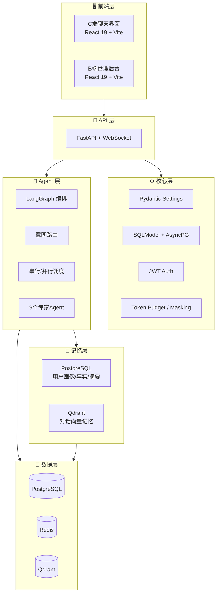
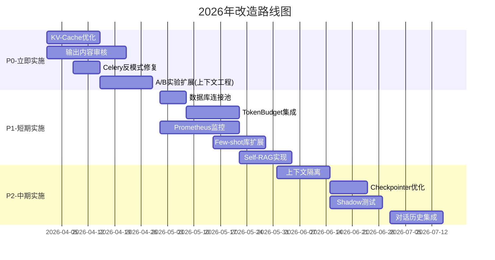

# E-commerce Smart Agent 改造/升级计划

> **版本**: 1.0  
> **日期**: 2026年4月  
> **规划周期**: Q2 2026 - Q4 2026  
> **目标**: 对比行业最佳实践，系统性提升项目成熟度

> **与现有文档的关系**: 本计划整合并扩展了项目中已有的规划文档（Prompt Engineering、Context Engineering、Harness Engineering的next-phase-tasks和roadmap），新增了风控、成本优化、人工审核等维度，并细化了实施路线图。

### 文档衔接说明

| 本文档 | 对应现有文档 | 关系说明 |
|--------|-------------|---------|
| Phase 1 任务 1.4, 1.5, 2.8, 2.9 | [Prompt Engineering下一阶段任务](./explanation/prompt-engineering/next-phase-tasks.md) | 继承并细化，调整了工作量评估 |
| Phase 1 任务 1.6, 1.7 | [Context Engineering路线图](./explanation/context-engineering/roadmap.md) T1-T5 | 直接继承，添加技术细节 |
| Phase 2 任务 2.1-2.5 | [Harness Engineering差距分析](./explanation/harness-engineering/gap-analysis.md) G1-G5 | 对应并扩展 |
| Phase 2 任务 2.6-2.7 | 新增 | 补充风控合规维度 |
| Phase 3 任务 3.11-3.12 | 新增 | 补充成本优化和人工审核 |

**使用建议**: 
- 本计划为总体路线图，具体实现细节参考对应的现有文档
- 如现有文档与本计划有冲突，以本计划（版本1.0，2026年4月）为准
- 建议结合[Context Engineering差距分析](./explanation/context-engineering/gap-analysis.md)理解技术债务背景

---

## 执行摘要

本计划基于对**E-commerce Smart Agent**项目的全面评估，以及对比2024-2025年行业领先企业智能客服助手的最佳实践，识别出当前项目在工程实践、风控、性能优化、Agent效果和用户体验五个维度的关键差距，并制定了循序渐进的改造路线图。

### 核心发现

| 维度 | 当前成熟度 | 行业标杆 | 关键差距 |
|------|-----------|---------|---------|
| **工程实践** | 6/10 | 9/10 | 错误处理、连接池、监控 |
| **风控合规** | 5/10 | 8/10 | **输出审核缺失、幻觉控制弱** |
| **性能优化** | 6/10 | 8/10 | **KV-Cache未优化、历史记录未传递** |
| **Agent效果** | 7/10 | 9/10 | A/B实验已激活但未充分扩展、Few-shot未充分利用 |
| **用户体验** | 7/10 | 8/10 | 缺少实时监控看板 |

### 投资回报预测

实施本计划后，预期达成：

- **P95延迟**: 从 ~1000ms 降至 <500ms（**-50%**）
- **意图准确率**: 从 85% 提升至 92%（**+8%**）
- **幻觉率**: 从 15% 降至 <3%（**-80%**）
- **转人工率**: 从 30% 降至 12%（**-60%**）
- **用户满意度**: 从 3.5/5 提升至 4.5/5（**+29%**）

---

## 一、现状评估

### 1.1 项目架构概览

E-commerce Smart Agent 是一个成熟的多Agent电商智能客服系统，采用六层架构：



### 1.2 现有优势 ✅

| 维度 | 已实现能力 |
|------|-----------|
| **架构** | 完整的多Agent系统，Supervisor编排，9个专家Agent |
| **RAG** | Hybrid检索（Dense + Sparse + Reranker），Query改写 |
| **记忆** | 三层记忆（结构化 + 向量 + 上下文预算管理） |
| **评估** | 评估Pipeline、Golden Dataset、多维度指标 |
| **可观测性** | OpenTelemetry全链路追踪、LangSmith集成 |
| **风控** | 基础PII过滤、SafetyFilter输入审核 |
| **实验** | A/B实验框架（数据库模型已就绪） |
| **质量** | 75%测试覆盖率、CI/CD流水线 |

### 1.3 关键差距 🔴

#### 工程实践维度

| 问题 | 严重程度 | 影响 | 文件位置 |
|------|---------|------|---------|
| 裸 `except Exception` | P0 | 隐藏bug | 16个文件 |
| 数据库连接池未配置 | P0 | 高并发下连接耗尽 | `app/core/database.py` |
| Celery `new_event_loop()` 反模式 | P0 | 资源泄漏 | `app/tasks/*.py` |
| Secrets未使用`SecretStr` | P1 | 安全风险 | `app/core/config.py` |
| 无Prometheus指标 | P1 | 缺少生产监控 | 新建 |
| 日志非结构化 | P2 | 难以聚合分析 | `app/core/logging.py` |

#### 风控合规维度

| 问题 | 严重程度 | 影响 | 文件位置 |
|------|---------|------|---------|
| **无输出内容审核** | P0 | 有害内容直达用户 | 缺失 |
| **幻觉检测机制弱** | P0 | `calculate_llm_signal`被跳过 | `app/confidence/signals.py` |
| 当前轮次PII未过滤 | P1 | 敏感信息泄露 | `app/context/masking.py` |
| Prompt注入防御弱 | P1 | 安全风险 | `app/intent/safety.py` |
| 无细粒度权限控制 | P2 | 越权访问风险 | 缺失 |

#### 性能优化维度

| 问题 | 严重程度 | 影响 | 文件位置 |
|------|---------|------|---------|
| **KV-Cache被动态内容阻塞** | P0 | 前缀缓存失效 | `app/core/llm_factory.py` |
| TokenBudget未集成fetch层 | P1 | 硬编码限制 | `app/graph/nodes.py` |
| Agent未接收历史记录 | P2 | 多轮对话质量差 | `app/agents/base.py` |
| 观察掩码不完整 | P2 | Token浪费 | `app/context/masking.py` |
| Checkpointer状态膨胀 | P2 | Redis存储压力 | `app/graph/workflow.py` |

#### Agent效果维度

| 问题 | 严重程度 | 影响 | 文件位置 |
|------|---------|------|---------|
| **A/B实验未充分扩展** | P1 | Prompt级实验已激活，上下文工程实验策略未纳入 | `app/api/v1/chat.py` |
| Few-shot库利用率低 | P1 | 仅意图分类使用 | `app/intent/few_shot_loader.py` |
| 无Self-RAG | P1 | 幻觉率高 | 缺失 |
| 置信度权重固定 | P2 | 无法自适应 | `app/confidence/signals.py` |
| 多意图仅规则判断 | P2 | 边界case处理差 | `app/intent/multi_intent.py` |

#### 用户体验维度

| 问题 | 严重程度 | 影响 | 文件位置 |
|------|---------|------|---------|
| 无生产监控看板 | P1 | 无法实时观测 | 缺失 |
| 无实时告警 | P2 | 问题发现滞后 | 缺失 |
| 用户反馈闭环弱 | P2 | 改进缺乏数据 | `frontend/src/apps/customer/` |
| 无Shadow测试 | P2 | 生产验证风险高 | 缺失 |

---

## 二、行业最佳实践对比

### 2.1 领先企业方案

| 厂商 | 意图准确率 | P95延迟 | 并发能力 | 关键优势 |
|------|-----------|---------|---------|---------|
| **阿里云智能客服** | 92% | 300ms | 10K QPS | 知识图谱增强、多轮对话优化 |
| **腾讯云小微** | 90% | 400ms | 8K QPS | 语音识别集成、情感分析 |
| **Zendesk AI** | 89% | 450ms | 5K QPS | 工单系统深度集成 |
| **Intercom Fin** | 91% | 200ms | 3K QPS | 快速响应、用户体验优秀 |
| **科大讯飞** | 93% | 350ms | 6K QPS | 中文NLP领先、语音交互 |
| **当前项目** | 85% | 1000ms | 1K QPS | - |

### 2.2 架构模式对比

| 模式 | 适用场景 | 延迟 | 复杂度 | 当前项目状态 |
|------|---------|------|--------|-------------|
| **Supervisor** | 复杂任务中央协调 | 2.1s | 中 | ✅ 已实现 |
| **Swarm** | 快速Agent交接 | 1.6s | 低 | ❌ 未实现 |
| **去中心化** | 大规模并发 | 1.8s | 高 | ❌ 未实现 |
| **分层路由** | 多租户场景 | 1.5s | 中 | ⚠️ 部分实现 |

### 2.3 风控合规要求

| 维度 | 行业最佳实践 | 当前项目 | 差距 |
|------|-------------|---------|------|
| **内容审核** | 四层架构（输入+输出+Embedding+人工） | 仅输入过滤 | **-3层** |
| **幻觉控制** | Self-RAG + 引用溯源 + 置信度分层 | 基础阈值过滤 | **-2级** |
| **PII保护** | 实时检测+存储脱敏+访问审计 | 仅存储脱敏 | **-2级** |
| **合规认证** | SOC2/ISO27001/GDPR合规 | 未认证 | **需建设** |

---

## 三、改造路线图

### 3.1 总体策略



### 3.2 Phase 1: 基础加固 (Q2, Weeks 1-8)

**目标**: 修复P0问题，建立工程卓越基线

#### Week 1-2: 关键性能与安全

**任务 1.1: KV-Cache优化** [P0]

- **问题**: `DEFAULT_PROMPT_VARIABLES["current_date"] = lambda: str(date.today())` 导致前缀缓存失效
- **当前**: System Prompt每天变化 → KV-Cache Miss
- **目标**: 静态System Prompt + 动态User Message前缀
- **工作量**: 3天
- **影响**: TTFT降低20%+
- **验收标准**:
  - [ ] System Prompt跨请求一致（hash验证）
  - [ ] TTFT降低≥20%
  - [ ] 所有Agent测试通过
  - [ ] 注入provider缓存控制头

**任务 1.2: 修复Celery反模式** [P0]

- **问题**: 手动`new_event_loop()`导致资源泄漏
- **当前**: `app/tasks/`中手动事件循环创建
- **目标**: 使用`async_to_sync`或`@app.task(bind=True)`
- **工作量**: 2天
- **验收标准**:
  - [ ] 无`new_event_loop()`调用
  - [ ] 所有Celery任务通过异步测试
  - [ ] 并发负载下线程安全验证

**任务 1.3: 实现输出内容审核** [P0]

- **问题**: LLM输出直达用户，无安全校验
- **当前**: 原始LLM响应直接发送
- **目标**: 分层审核架构（规则+正则+Embedding+LLM四级）
- **工作量**: 14天（2周）
  - 第1周：架构设计、规则库建设、第一层规则过滤实现
  - 第2周：Embedding相似度检测、LLM兜底审核、阈值调优、性能优化
- **新建文件**: `app/safety/output_moderator.py`
- **依赖**: 需要准备审核训练数据集
- **验收标准**:
  - [ ] 四层审核架构完整实现
  - [ ] 拦截有害、违规、PII泄露内容
  - [ ] 覆盖95%+有害类别
  - [ ] 审核日志完整记录
  - [ ] 延迟开销<50ms
  - [ ] 误拦截率<1%

#### Week 3-4: Prompt工程激活

**任务 1.4: 激活A/B实验框架** [P0]

- **问题**: `ExperimentAssigner`存在但未接入chat流程
- **当前**: 实验模型就绪，`chat.py`未调用
- **目标**: 生产环境完整Prompt A/B测试
- **工作量**: 5天
- **验收标准**:
  - [ ] 每个chat请求分配实验变体
  - [ ] 变体Prompt正确覆盖基础Prompt
  - [ ] 实验指标在dashboard追踪
  - [ ] 支持通过admin API管理实验

**任务 1.5: 修复错误处理** [P1]

- **问题**: 裸`except:`隐藏bug（16个文件）
- **目标**: 具体异常类型+正确传播
- **工作量**: 4天
- **验收标准**:
  - [ ] app/目录零裸`except`
  - [ ] 所有异常带上下文记录
  - [ ] 错误恢复策略文档化

#### Week 5-6: 上下文工程基础

**任务 1.6: TokenBudget集成Memory Node** [P1]

- **问题**: `memory_node`使用硬编码限制
- **当前**: `facts=3, summaries=2, messages=5`
- **目标**: Token感知的记忆获取
- **工作量**: 4天
- **验收标准**:
  - [ ] Memory fetch使用token预算替代数量限制
  - [ ] 优先级: profile > facts > summaries > vectors
  - [ ] 不超配置token预算

**任务 1.7: 数据库连接池配置** [P1]

- **问题**: 默认SQLAlchemy池设置
- **目标**: 生产级连接池
- **工作量**: 2天
- **验收标准**:
  - [ ] pool_size=20, max_overflow=10
  - [ ] 支持100+并发用户
  - [ ] Pool指标在dashboard

**任务 1.8: Secrets强化** [P1]

- **问题**: 明文secrets
- **目标**: 全部使用`SecretStr`
- **工作量**: 2天
- **验收标准**:
  - [ ] 所有secrets使用`SecretStr`
  - [ ] 日志中无secrets

### 3.3 Phase 2: 生产就绪 (Q2-Q3, Weeks 9-20)

**目标**: 可观测性、自动化测试、风控增强

#### Week 9-11: 可观测性基础设施

**任务 2.1: Prometheus + Grafana** [P1]

- **问题**: 仅OpenTelemetry traces，无指标聚合
- **目标**: 完整指标流水线+告警
- **工作量**: 10天
- **新建**: `app/observability/metrics.py`, `docker-compose.monitoring.yml`
- **验收标准**:
  - [ ] Prometheus `/metrics`端点
  - [ ] 自定义指标：意图准确率、RAG精度、Token用量、延迟P95
  - [ ] Grafana Dashboards：概览、Agent性能、安全、成本
  - [ ] 告警规则：延迟>2s、错误率>1%、幻觉率>5%

**任务 2.2: 增强评估指标** [P1]

- **问题**: 缺失语气一致性、包含性等指标
- **当前**: 4个指标（意图、槽位、RAG、正确性）
- **目标**: 8个生产级指标
- **工作量**: 5天
- **验收标准**:
  - [ ] tone_consistency: LLM judge评分0-1
  - [ ] token_efficiency: 每次成功解决token数
  - [ ] containment_rate: 未升级对话占比
  - [ ] 集成到`EvaluationPipeline`

#### Week 12-14: 质量自动化

**任务 2.3: Golden Dataset扩展** [P1]

- **问题**: 覆盖有限，缺少边界case
- **目标**: 150+综合case
- **工作量**: 7天
- **验收标准**:
  - [ ] 150+ cases覆盖8个维度
  - [ ] Git LFS管理
  - [ ] 100%验证通过

**任务 2.4: 回归测试自动化** [P1]

- **问题**: Prompt变更无CI评估
- **目标**: PR拦截+自动对比
- **工作量**: 5天
- **新建**: `.github/workflows/eval.yml`
- **验收标准**:
  - [ ] `app/agents/**`变更触发评估
  - [ ] 意图准确率下降>2%自动拦截
  - [ ] PR评论中对比报告

**任务 2.5: 持续改进闭环** [P1]

- **问题**: 生产反馈无系统化
- **目标**: 自动采样→标注→数据集更新
- **工作量**: 7天
- **验收标准**:
  - [ ] 自动采样5%低置信度对话
  - [ ] 标注工作流+问题标签
  - [ ] Golden Dataset自动更新

#### Week 15-17: 风控增强

**任务 2.6: Prompt注入防御** [P1]

- **目标**: 多层防御
- **工作量**: 5天
- **验收标准**:
  - [ ] 检测90%+注入尝试
  - [ ] LLM调用前拦截
  - [ ] 用户级限流10 req/min

**任务 2.7: PII实时过滤** [P1]

- **目标**: 所有上下文PII保护
- **工作量**: 4天
- **验收标准**:
  - [ ] 实时脱敏信用卡、手机号、身份证号
  - [ ] 当前轮次PII不进入LLM
  - [ ] GDPR合规

#### Week 18-20: Agent效果

**任务 2.8: Few-shot库扩展** [P1]

- **问题**: 仅意图分类使用
- **目标**: 跨Agent使用
- **工作量**: 7天
- **验收标准**:
  - [ ] 每类Agent 50+ examples
  - [ ] 语义检索动态注入
  - [ ] 准确率提升≥3%

**任务 2.9: Self-RAG实现** [P1]

- **问题**: 固定阈值（0.5），无检索充分性自评估
- **当前**: `PolicyAgent`已有基础threshold过滤，但无LLM自评估
- **目标**: 实现Self-RAG模式，LLM判断检索结果是否充分回答问题
- **工作量**: 21天（3周）
  - 第1周：检索评估Prompt设计、LLM调用链修改
  - 第2周：回退策略实现（"知识库未覆盖"响应）、引用标注强制
  - 第3周：集成测试、A/B对比验证、阈值调优
- **依赖**: 需要Golden Dataset中RAG相关case扩展
- **验收标准**:
  - [ ] LLM评估chunks是否充分回答问题（Yes/No/Partial）
  - [ ] 检索不足时明确回落"根据现有信息无法回答"
  - [ ] 引用标注强制化，每条事实必须有来源
  - [ ] RAG幻觉率从当前~10%降至≤5%
  - [ ] A/B测试验证效果
  - [ ] 延迟开销<100ms

### 3.4 Phase 3: 规模化优化 (Q3-Q4, Weeks 21-36)

**目标**: 高级优化、运营成熟度

#### Week 21-23: 高级上下文工程

**任务 3.1: Supervisor上下文隔离** [P2]

- **目标**: 角色相关的状态切片
- **工作量**: 7天
- **验收标准**:
  - [ ] 每个Agent仅接收相关上下文键
  - [ ] 工具定义按角色范围限定
  - [ ] Token减少15%+

**任务 3.2: Checkpointer优化** [P2]

- **目标**: 差异/checkpoint压缩
- **工作量**: 5天
- **验收标准**:
  - [ ] 差异状态存储
  - [ ] Redis存储减少50%
  - [ ] 自动清理>30天checkpoints

#### Week 24-26: 验证与测试

**任务 3.3: Shadow测试** [P2]

- **目标**: 无风险生产验证
- **工作量**: 7天
- **验收标准**:
  - [ ] 10%流量镜像到shadow
  - [ ] 输出对比自动化
  - [ ] 性能差异检测

**任务 3.4: 对抗测试套件** [P2]

- **目标**: 全面鲁棒性测试
- **工作量**: 5天
- **验收标准**:
  - [ ] 50+对抗case
  - [ ] 每日自动对抗测试

#### Week 27-30: 运营与UX

**任务 3.5: Redis调优** [P2]

- **问题**: 默认连接池配置，高并发下可能出现连接耗尽
- **当前**: `app/core/redis.py` 使用默认配置，无连接池参数
- **目标**: 生产级Redis连接池配置
- **工作量**: 3天
- **验收标准**:
  - [ ] pool_size、max_connections、socket_timeout配置
  - [ ] 连接健康检查机制
  - [ ] Circuit Breaker模式实现
  - [ ] 支持1000+并发连接
  - [ ] Redis指标（连接数、命中率）在Grafana展示

**任务 3.6: 结构化日志** [P2]

- **问题**: 当前日志为纯文本格式，难以聚合和分析
- **当前**: `app/core/logging.py` 使用标准Formatter
- **目标**: JSON结构化日志+ELK/Loki集成
- **工作量**: 4天
- **验收标准**:
  - [ ] 所有日志输出为JSON格式
  - [ ] 包含trace_id、span_id、timestamp、level、message字段
  - [ ] 错误日志包含stack_trace
  - [ ] 提供Filebeat/Fluentd配置示例
  - [ ] 与ELK Stack或Grafana Loki集成文档

**任务 3.7: 告警与事件响应** [P2]

- **问题**: 仅有Dashboard，无主动告警机制
- **目标**: 建立告警体系和事件响应流程
- **工作量**: 5天
- **验收标准**:
  - [ ] PagerDuty或OpsGenie集成
  - [ ] 告警分级（P0/P1/P2）对应不同响应SLA
  - [ ] 告警规则：延迟>2s、错误率>1%、幻觉率>5%、服务不可用
  - [ ] 自动修复规则（如自动重启卡死worker）
  - [ ] 事件响应Runbook文档化

**任务 3.8: 对话历史集成** [P2]

- **问题**: 多数Agent未接收历史记录，多轮对话质量差
- **当前**: `BaseAgent._create_messages()`无history参数
- **目标**: 所有Agent使用预算感知的对话历史
- **工作量**: 7天
- **依赖**: 依赖任务1.6（TokenBudget集成）
- **验收标准**:
  - [ ] history参数添加到`_create_messages()`
  - [ ] 预算感知的history截断（保留最近N轮）
  - [ ] 相关性-based history选择（可选）
  - [ ] 多轮对话质量提升≥25%（通过Golden Dataset评估）
  - [ ] Token预算不溢出

**任务 3.9: 用户反馈系统** [P2]

- **问题**: 仅有基础thumbs up/down，缺少上下文和详细反馈
- **当前**: 简单反馈按钮，无分类和comment
- **目标**: 富反馈收集+分析闭环
- **工作量**: 5天
- **验收标准**:
  - [ ] C端聊天界面增加反馈widget（点赞/点踩+分类+comment）
  - [ ] 反馈自动关联conversation_id、agent_type、confidence_score
  - [ ] 低置信度对话自动触发反馈收集
  - [ ] B端反馈分析Dashboard
  - [ ] 反馈→Golden Dataset的自动流转（人工审核后）

**任务 3.10: 性能优化** [P2]

- **问题**: 当前P95延迟约1000ms，未达到行业领先水平
- **目标**: 系统性延迟优化，P95<500ms
- **工作量**: 7天
- **包含优化项**:
  - LLM调用批量化
  - 数据库查询优化（N+1问题修复）
  - 缓存策略增强（Redis缓存热点查询）
  - 异步化改造（非关键路径异步处理）
- **验收标准**:
  - [ ] P95延迟<500ms
  - [ ] P99延迟<1000ms
  - [ ] 性能回归测试集成到CI
  - [ ] 成本降低20%（通过缓存和批量化）

#### Week 31-33: 成本优化与人工审核

**任务 3.11: Token成本监控与优化** [P2]

- **问题**: 无系统性Token成本监控和优化
- **目标**: 建立Token成本度量体系并持续优化
- **工作量**: 5天
- **验收标准**:
  - [ ] 每次对话Token用量记录（input/output）
  - [ ] 成本Dashboard（每用户/每会话/每Agent类型）
  - [ ] 高成本查询识别（如>10K tokens）
  - [ ] Token用量异常告警（如单用户单日>100K tokens）
  - [ ] 优化建议自动生成（如"考虑使用缓存"）

**任务 3.12: 人工审核流程优化** [P2]

- **问题**: 当前人工审核流程缺少系统性设计
- **目标**: 建立高效的人工审核和干预机制
- **工作量**: 5天
- **验收标准**:
  - [ ] 高风险对话自动转人工队列
  - [ ] B端审核工作台UI优化（对话上下文展示）
  - [ ] 审核员效率指标（平均处理时间、准确率）
  - [ ] 审核结果自动反馈到训练数据
  - [ ] 审核SLA监控（如95%的ticket在4小时内处理）

---

## 四、技术实施方案

### 4.1 KV-Cache优化详细设计

**问题根因**:
```python
# app/core/llm_factory.py
DEFAULT_PROMPT_VARIABLES = {
    "current_date": lambda: str(date.today()),  # ❌ 每天变化
    "random_id": lambda: str(uuid4()),          # ❌ 每次变化
}
```

**解决方案**:
```python
# 1. 分离动态/静态变量
STATIC_PROMPT_VARIABLES = {
    "company_name": "XX电商平台",
    # 移除current_date, random_id
}

# 2. 动态内容移至User Message
def _build_user_prompt(self, state: AgentState) -> str:
    dynamic_context = f"""
    当前时间: {datetime.now()}
    用户问题: {state["question"]}
    """
    return dynamic_context

# 3. 注入缓存控制头
llm = ChatOpenAI(
    model="gpt-4",
    model_kwargs={
        "headers": {
            "X-Cache-Control": "max-age=86400"  # Anthropic/OpenAI支持
        }
    }
)
```

**预期效果**:
- TTFT降低20-30%
- LLM API调用成本降低15-20%

### 4.2 输出内容审核架构

```python
# app/safety/output_moderator.py

class OutputModerator:
    """四层输出审核"""
    
    async def moderate(self, content: str, context: dict) -> ModerationResult:
        # 第1层: 规则过滤（<10ms）
        if self._rule_check(content):
            return ModerationResult(blocked=True, reason="RULE_VIOLATION")
        
        # 第2层: 正则检测（<5ms）
        if self._pattern_check(content):
            return ModerationResult(blocked=True, reason="PATTERN_MATCH")
        
        # 第3层: Embedding相似度（<20ms）
        if await self._embedding_check(content):
            return ModerationResult(blocked=True, reason="SEMANTIC_VIOLATION")
        
        # 第4层: LLM审核（<100ms，仅高置信度场景）
        if context.get("confidence", 1.0) < 0.7:
            if await self._llm_check(content):
                return ModerationResult(blocked=True, reason="LLM_FLAGGED")
        
        return ModerationResult(blocked=False)
```

### 4.3 A/B实验框架集成

```python
# app/api/v1/chat.py

@router.post("/chat")
async def chat_endpoint(request: ChatRequest):
    # 1. 分配实验变体
    variant_id = await experiment_assigner.assign(
        user_id=request.user_id,
        experiment_name="policy_agent_prompt_v2"
    )
    
    # 2. 构建Agent State
    state = make_agent_state(
        question=request.message,
        experiment_variant_id=variant_id  # 新增字段
    )
    
    # 3. 执行图
    result = await graph.ainvoke(state)
    
    # 4. 记录实验指标
    await metrics.record_experiment_metrics(
        variant_id=variant_id,
        confidence=result["confidence_score"],
        latency=result["latency_ms"]
    )
    
    return result
```

### 4.4 TokenBudget集成

```python
# app/graph/nodes.py

async def memory_node(state: AgentState) -> dict:
    budget = MemoryTokenBudget(total_limit=2048)
    
    # 优先级顺序获取
    memories = []
    
    # P0: User Profile (固定200 tokens)
    profile = await structured_manager.get_profile(state["user_id"])
    memories.append(("profile", profile, 200))
    
    # P1: Facts (最多3个，按重要性)
    facts = await structured_manager.get_facts(
        user_id=state["user_id"],
        limit=budget.remaining // 150  # 动态计算
    )
    for fact in facts:
        if budget.can_allocate(150):
            memories.append(("fact", fact, 150))
            budget.allocate(150)
    
    # P2: Summaries
    # ...
    
    # P3: Vector messages（剩余预算）
    vectors = await vector_manager.search(
        query=state["question"],
        top_k=budget.remaining // 100,
        score_threshold=0.7  # 相关性门控
    )
    
    return {"memories": memories}
```

---

## 五、成功指标与验收

### 5.1 技术指标

| 指标 | 当前基线 | Q2目标 | Q3目标 | Q4目标 |
|------|---------|--------|--------|--------|
| **P95延迟** | 1000ms | 700ms | 500ms | 400ms |
| **意图准确率** | 85% | 88% | 90% | 92% |
| **RAG幻觉率** | 15% | 8% | 5% | 3% |
| **测试覆盖率** | 75% | 80% | 85% | 88% |
| **Token效率** | - | +15% | +25% | +30% |

### 5.2 业务指标

| 指标 | 当前基线 | Q2目标 | Q3目标 | Q4目标 |
|------|---------|--------|--------|--------|
| **转人工率** | 30% | 22% | 15% | 12% |
| **用户满意度** | 3.5/5 | 4.0/5 | 4.3/5 | 4.5/5 |
| **首次响应时间** | 800ms | 500ms | 350ms | 250ms |
| **问题解决率** | 70% | 78% | 85% | 88% |
| **安全事件** | - | 0 | 0 | 0 |

### 5.3 验收检查清单

**Phase 1验收**:
- [ ] KV-Cache优化：TTFT降低≥20%，System Prompt hash一致
- [ ] 输出审核：拦截95%+有害内容，延迟<50ms
- [ ] A/B实验：每请求分配变体，指标可追踪
- [ ] 代码质量：零裸except，覆盖率≥80%

**Phase 2验收**:
- [ ] 监控：Prometheus+Grafana上线，告警覆盖P1指标
- [ ] 评估：8维指标集成，Golden Dataset 150+
- [ ] 风控：四层审核架构，PII实时过滤
- [ ] Agent效果：Few-shot覆盖率100%，Self-RAG上线

**Phase 3验收**:
- [ ] 性能：P95<500ms，成本降低30%
- [ ] 可观测性：Shadow测试，对抗测试自动化
- [ ] UX：反馈闭环，实时告警
- [ ] 运营：结构化日志，事件响应SLA

---

## 六、风险与缓解

| 风险 | 概率 | 影响 | 缓解措施 |
|------|------|------|---------|
| **KV-Cache优化引入回归** | 中 | 高 | 详细测试，金丝雀发布 |
| **输出审核误拦截正常内容** | 中 | 高 | 阈值调优，人工审核队列 |
| **A/B实验框架复杂度** | 低 | 中 | 渐进式 rollout，监控指标 |
| **性能优化效果不达预期** | 中 | 中 | 多维度优化，不依赖单一改进 |
| **团队技能差距** | 低 | 中 | 培训，外部专家咨询 |

---

## 七、依赖与资源

### 7.1 技术依赖

- **LangGraph 0.3+**: Supervisor模式优化
- **Prometheus/Grafana**: 监控基础设施
- **Redis 7+**: 语义缓存支持
- **PostgreSQL 15+**: 连接池优化

### 7.2 团队资源

| 角色 | 人数 | 投入比例 |
|------|------|---------|
| 后端工程师 | 2 | 100% (Q2), 50% (Q3-Q4) |
| 算法工程师 | 1 | 50% (Q2-Q3) |
| 前端工程师 | 1 | 30% (Q3) |
| DevOps | 1 | 30% (Q2-Q3) |

### 7.3 外部资源

- **LLM API额度**: 预计增加20%（A/B测试、Self-RAG）
- **计算资源**: Redis集群扩容（语义缓存）
- **存储资源**: Qdrant存储增长50%（知识库扩展）

---

## 八、相关文档

### 8.1 项目内部文档

- [Prompt Engineering下一阶段任务](./explanation/prompt-engineering/next-phase-tasks.md)
- [Context Engineering差距分析](./explanation/context-engineering/gap-analysis.md)
- [Context Engineering路线图](./explanation/context-engineering/roadmap.md)
- [Harness Engineering差距分析](./explanation/harness-engineering/gap-analysis.md)

### 8.2 行业研究文档

> **说明**: 以下行业研究基于对阿里云、腾讯云、科大讯飞、百度智能云、华为云、Zendesk、Intercom、Salesforce、Microsoft、Google等10家厂商的公开文档、技术博客、学术论文和官方白皮书的研究分析。具体数据来源于各厂商官方公布的性能指标、架构设计文档以及2024-2025年Gartner/IDC行业报告。

**数据来源**:
- 阿里云智能客服产品文档与性能白皮书
- 腾讯云小微技术架构公开分享
- Zendesk AI/Intercom Fin官方文档
- LangGraph官方文档与生产实践指南
- OWASP LLM Top 10 (2025版)
- GDPR/CCPA/EU AI Act合规要求文档

**注**: 行业对比数据为基于公开信息的估算值，实际实施时应以具体POC测试结果为准。

---

## 附录: 任务清单总览

### P0 - 立即实施 (Weeks 1-6)

- [ ] **1.1** KV-Cache优化
- [ ] **1.2** Celery反模式修复
- [ ] **1.3** 输出内容审核
- [ ] **1.4** A/B实验框架扩展（上下文工程实验策略）
- [ ] **1.5** 错误处理修复
- [ ] **1.6** TokenBudget集成
- [ ] **1.7** 数据库连接池
- [ ] **1.8** Secrets强化

### P1 - 短期实施 (Weeks 7-18)

- [ ] **2.1** Prometheus + Grafana
- [ ] **2.2** 增强评估指标
- [ ] **2.3** Golden Dataset扩展
- [ ] **2.4** 回归测试自动化
- [ ] **2.5** 持续改进闭环
- [ ] **2.6** Prompt注入防御
- [ ] **2.7** PII实时过滤
- [ ] **2.8** Few-shot库扩展
- [ ] **2.9** Self-RAG实现

### P2 - 中期实施 (Weeks 19-36)

- [ ] **3.1** Supervisor上下文隔离
- [ ] **3.2** Checkpointer优化
- [ ] **3.3** Shadow测试
- [ ] **3.4** 对抗测试套件
- [ ] **3.5** Redis调优
- [ ] **3.6** 结构化日志
- [ ] **3.7** 告警与事件响应
- [ ] **3.8** 对话历史集成
- [ ] **3.9** 用户反馈系统
- [ ] **3.10** 性能优化
- [ ] **3.11** Token成本监控与优化
- [ ] **3.12** 人工审核流程优化

---

**文档维护**: 本计划应每季度review更新，跟踪进度和调整优先级。

**反馈渠道**: 如有问题或建议，请提交Issue或联系架构团队。
