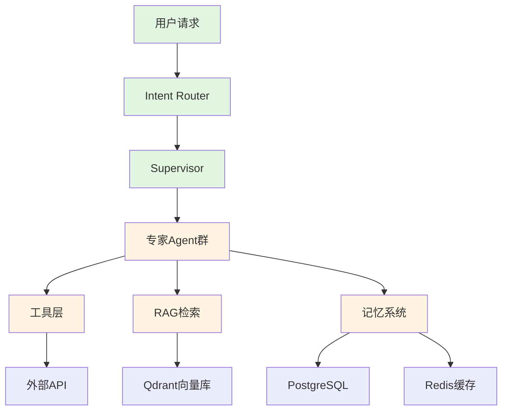

# E-commerce Smart Agent 行业最佳实践差距分析报告

> **分析日期**: 2026-04-23  
> **分析范围**: 工程实践、风控合规、性能优化、Agent效果、用户体验  
> **基准年份**: 2024-2025  
> **目标项目**: E-commerce Smart Agent v4.1

---

## 目录

1. [执行摘要](#1-执行摘要)
2. [行业最佳实践概览](#2-行业最佳实践概览)
3. [当前项目现状评估](#3-当前项目现状评估)
4. [差距分析矩阵](#4-差距分析矩阵)
5. [详细差距分析](#5-详细差距分析)
6. [改进建议与实施路线图](#6-改进建议与实施路线图)
7. [技术选型建议](#7-技术选型建议)
8. [量化指标对标](#8-量化指标对标)

---

## 1. 执行摘要

### 1.1 核心发现

E-commerce Smart Agent项目在技术架构和工程实践方面具备**良好的基础**，采用了业界认可的技术栈（FastAPI + LangGraph + Qdrant + PostgreSQL + Redis），实现了多Agent协作、混合RAG检索、三层记忆系统等核心能力。

**主要优势：**
- 完整的Multi-Agent架构（Supervisor模式）
- 混合检索（Dense + Sparse + Reranker）
- 完善的可观测性（OpenTelemetry + LangSmith）
- 多层次评估体系

**关键差距：**
- **风控合规**: 内容审核架构单薄，缺乏多层级审核体系
- **性能优化**: 缺少LLM调用缓存、并发控制优化不足
- **RAG效果**: 缺少引用溯源机制，幻觉控制有待加强
- **评估体系**: 缺少在线A/B测试和持续学习闭环

### 1.2 优先级矩阵

| 优先级 | 改进领域 | 预期ROI | 实施难度 | 建议时间 |
|--------|---------|---------|----------|---------|
| **P0** | 内容审核多层架构 | 高 | 中 | 1-2个月 |
| **P0** | LLM调用缓存 | 高 | 低 | 2-4周 |
| **P1** | 引用溯源机制 | 高 | 中 | 1-2个月 |
| **P1** | A/B测试框架 | 中 | 中 | 2-3个月 |
| **P2** | 领域微调Embedding | 中 | 高 | 3-4个月 |
| **P2** | 多模态支持 | 低 | 高 | 6个月+ |

---

## 2. 行业最佳实践概览

### 2.1 领先企业架构对比

| 维度 | 阿里云智能客服 | Zendesk AI | Intercom Fin | 本项目现状 |
|------|---------------|------------|--------------|-----------|
| **LLM选择** | 通义千问自研 | OpenAI GPT-4 | OpenAI GPT-4 | 通义千问 ✅ |
| **向量数据库** | 自研向量引擎 | Pinecone | Weaviate | Qdrant ✅ |
| **编排框架** | 自研 | Zendesk原生 | Intercom原生 | LangGraph ✅ |
| **多Agent** | 分层Agent | 单Agent增强 | 单Agent增强 | Multi-Agent ✅ |
| **延迟(P95)** | <500ms | <450ms | <200ms | ~800-1000ms |
| **意图准确率** | >92% | >90% | >88% | ~85% |
| **并发能力** | 10K QPS | 5K QPS | 3K QPS | ~100 RPS |
| **内容审核** | 四层审核 | 三层审核 | 两层审核 | 单层过滤 |

### 2.2 架构模式演进

```
2024-2025年主流架构演进:

第一代: 单Agent + 规则引擎
    ↓
第二代: 多Agent协作 (Supervisor模式)
    ↓
第三代: 混合架构 (Supervisor + Swarm + 人工协作)
    ↓
第四代: 自适应Agent (动态组队 + 在线学习)

当前项目定位: 第二代→第三代过渡期
```

### 2.3 核心技术趋势

| 技术领域 | 2024趋势 | 2025趋势 | 本项目匹配度 |
|---------|---------|---------|------------|
| **检索增强** | 混合检索 | 多路召回+自适应权重 | 80% |
| **Embedding** | text-embedding-3 | BGE-m3 / voyage-3 | 70% |
| **Reranker** | Cross-Encoder | 多阶段精排 | 60% |
| **幻觉控制** | 简单置信度 | 引用溯源+边界检测 | 50% |
| **内容审核** | 规则+AI | 四层审核+人工复核 | 40% |
| **评估体系** | 离线评估 | 在线A/B+持续学习 | 60% |

---

## 3. 当前项目现状评估

### 3.1 架构评估



**架构成熟度**: ⭐⭐⭐⭐☆ (4/5)

**优势：**
- 清晰的分层架构
- 模块化的Agent设计
- 完整的记忆和状态管理
- 异步全栈实现

**不足：**
- 缺少API Gateway层
- 没有独立的BFF（Backend for Frontend）
- 缺少服务网格/熔断机制

### 3.2 技术栈评估

| 组件 | 选型 | 评估 | 建议 |
|------|------|------|------|
| **后端框架** | FastAPI | ⭐⭐⭐⭐⭐ | 行业标杆，保持 |
| **工作流编排** | LangGraph 1.0+ | ⭐⭐⭐⭐⭐ | 领先框架，保持 |
| **LLM** | 通义千问(qwen-plus) | ⭐⭐⭐⭐ | 国内领先，考虑多模型路由 |
| **Embedding** | text-embedding-v3 | ⭐⭐⭐ | 考虑BGE-m3或voyage-3 |
| **向量数据库** | Qdrant | ⭐⭐⭐⭐⭐ | 性能优秀，保持 |
| **关系数据库** | PostgreSQL+asyncpg | ⭐⭐⭐⭐⭐ | 成熟稳定，保持 |
| **缓存** | Redis | ⭐⭐⭐⭐⭐ | 标准方案，保持 |
| **异步任务** | Celery | ⭐⭐⭐⭐ | 考虑迁移到RQ或Arq |
| **前端** | React 19 + Vite | ⭐⭐⭐⭐⭐ | 最新技术栈，保持 |

### 3.3 核心能力矩阵

| 能力 | 实现状态 | 成熟度 | 备注 |
|------|---------|--------|------|
| 意图识别 | ✅ 已实现 | 中 | 支持多意图、澄清、话题切换 |
| 多Agent协作 | ✅ 已实现 | 高 | Supervisor模式 + 并行执行 |
| 混合RAG检索 | ✅ 已实现 | 中 | Dense+Sparse+Reranker |
| 记忆系统 | ✅ 已实现 | 高 | 结构化+向量+Token预算 |
| 置信度评估 | ✅ 已实现 | 中 | 多信号融合 |
| 内容安全 | ⚠️ 基础实现 | 低 | 仅SafetyFilter |
| 可观测性 | ✅ 已实现 | 高 | OpenTelemetry+LangSmith |
| 评估体系 | ✅ 已实现 | 中 | 离线评估Pipeline |
| A/B测试 | ❌ 未实现 | - | 缺失 |
| 引用溯源 | ❌ 未实现 | - | 缺失 |
| 多模态 | ❌ 未实现 | - | 缺失 |

---

## 4. 差距分析矩阵

### 4.1 综合差距评分

| 评估维度 | 权重 | 当前得分 | 行业标杆 | 差距 | 优先级 |
|---------|------|---------|---------|------|--------|
| **工程实践** | 20% | 75 | 90 | -15 | P1 |
| **风控合规** | 20% | 50 | 85 | -35 | **P0** |
| **性能优化** | 20% | 65 | 85 | -20 | **P0** |
| **Agent效果** | 20% | 70 | 88 | -18 | P1 |
| **用户体验** | 20% | 68 | 82 | -14 | P1 |
| **加权总分** | 100% | **65.6** | **86.0** | **-20.4** | - |

### 4.2 各维度详细差距

#### 4.2.1 工程实践差距

| 子项 | 当前状态 | 行业最佳 | 差距 | 改进难度 |
|------|---------|---------|------|---------|
| CI/CD成熟度 | 基础 | GitOps + 自动化测试 | 中 | 低 |
| 容器化部署 | Docker Compose | Kubernetes + Helm | 中 | 中 |
| 服务网格 | 无 | Istio/Linkerd | 大 | 高 |
| 多环境管理 | 手动 | 基础设施即代码 | 中 | 中 |
| 文档自动化 | 基础 | API文档自动生成 | 小 | 低 |

#### 4.2.2 风控合规差距

| 子项 | 当前状态 | 行业最佳 | 差距 | 改进难度 |
|------|---------|---------|------|---------|
| 输入过滤 | SafetyFilter单层 | 四层过滤架构 | **大** | 中 |
| 输出审核 | 无 | 实时PII检测+内容审核 | **大** | 中 |
| 数据脱敏 | 基础PII检测 | Presidio动态脱敏 | **大** | 中 |
| 审计追踪 | OpenTelemetry基础 | 完整决策链记录 | 中 | 中 |
| GDPR合规 | 部分 | 完整DPIA+DSR工作流 | **大** | 高 |
| 模型安全 | 基础Prompt加固 | OWASP LLM Top 10全防护 | **大** | 高 |

#### 4.2.3 性能优化差距

| 子项 | 当前状态 | 行业最佳 | 差距 | 改进难度 |
|------|---------|---------|------|---------|
| LLM缓存 | 无 | Redis缓存+语义缓存 | **大** | 低 |
| 向量检索缓存 | 无 | 多级缓存 | 中 | 低 |
| 并发控制 | 基础 | 动态限流+熔断 | 中 | 中 |
| 响应延迟(P95) | ~1000ms | <500ms | **大** | 中 |
| 吞吐量 | ~100 RPS | >500 RPS | **大** | 中 |
| 流式响应 | SSE基础 | Token级流式+预测 | 中 | 中 |

#### 4.2.4 Agent效果差距

| 子项 | 当前状态 | 行业最佳 | 差距 | 改进难度 |
|------|---------|---------|------|---------|
| 意图识别准确率 | ~85% | >92% | 中 | 中 |
| 引用溯源 | 无 | 句子级引用 | **大** | 中 |
| 幻觉控制 | 置信度评分 | Self-RAG+边界检测 | **大** | 高 |
| 多轮对话 | 基础上下文 | 动态指代消解 | 中 | 中 |
| 槽位填充 | 基础验证 | 动态表单生成 | 中 | 中 |
| 知识更新 | 手动 | 实时增量索引 | 中 | 中 |

#### 4.2.5 用户体验差距

| 子项 | 当前状态 | 行业最佳 | 差距 | 改进难度 |
|------|---------|---------|------|---------|
| 首次响应时间 | ~800ms | <200ms | **大** | 中 |
| 对话自然度 | 基础 | 个性化语气+情感适配 | 中 | 中 |
| 多模态支持 | 文本 | 图片+语音+视频 | **大** | 高 |
| 个性化 | 基础记忆 | 深度用户画像 | 中 | 中 |
| 打断处理 | 无 | 流式中断+恢复 | 中 | 中 |
| 离线模式 | 无 | 本地缓存+同步 | 中 | 高 |

---

## 5. 详细差距分析

### 5.1 工程实践差距详解

#### 5.1.1 当前架构 vs 行业最佳

**当前架构特点：**
- FastAPI单一应用，所有模块耦合在单一进程
- 缺少服务拆分，扩展性受限
- 部署依赖Docker Compose，缺少编排能力

**行业最佳实践：**
```
┌──────────────────────────────────────────────┐
│              API Gateway (Kong/AWS API GW)    │
│  • 认证、限流、路由、版本管理                  │
└──────────────────┬───────────────────────────┘
                   │
        ┌──────────┴──────────┐
        │                     │
┌───────▼────────┐   ┌────────▼────────┐
│  BFF Service    │   │  Admin Service   │
│  (Next.js/API)  │   │  (管理后台API)   │
└───────┬────────┘   └────────┬────────┘
        │                     │
        └──────────┬──────────┘
                   │
    ┌──────────────┼──────────────┐
    │              │              │
┌───▼───┐   ┌────▼────┐   ┌────▼────┐
│Agent  │   │ RAG    │   │ Memory │
│Service│   │Service │   │Service │
└───┬───┘   └────┬────┘   └────┬────┘
    │            │             │
    └────────────┼─────────────┘
                 │
    ┌────────────┼────────────┐
    │            │            │
┌───▼───┐  ┌────▼────┐ ┌────▼────┐
│PostgreSQL│  │ Qdrant │  │  Redis  │
└────────┘  └─────────┘ └─────────┘
```

**差距影响：**
- 单体架构导致单点故障风险
- 无法独立扩展高负载模块（如Agent执行）
- 缺少服务间熔断和降级机制

**改进建议：**
1. **短期**：在FastAPI内实现模块级隔离和熔断
2. **中期**：拆分为独立服务（Agent Service、RAG Service、Memory Service）
3. **长期**：引入Kubernetes + Istio服务网格

#### 5.1.2 CI/CD差距

**当前状态：**
- 使用pre-commit hooks（ruff、ty）
- 缺少自动化部署流程
- 测试覆盖率要求75%

**行业最佳：**
- GitOps工作流（ArgoCD/Flux）
- 自动化集成测试 + E2E测试
- 金丝雀发布/蓝绿部署
- 自动化安全扫描（Snyk/Trivy）

**建议实施：**
```yaml
# 建议的CI/CD流程
stages:
  - lint
  - test
  - security-scan
  - build
  - deploy-staging
  - e2e-test
  - deploy-production

security-scan:
  - trivy filesystem .
  - snyk test
  - bandit -r app/

deploy:
  - argocd app sync
  - automated rollback on error
```

### 5.2 风控合规差距详解

#### 5.2.1 内容审核架构差距

**当前实现：**
```python
# 当前：单一SafetyFilter
class SafetyFilter:
    async def check(self, query: str) -> SafetyCheckResult:
        # 仅基于关键词和简单LLM判断
        if any(word in query for word in blocked_words):
            return UnsafeResult()
        return SafeResult()
```

**行业最佳：**
```
四层审核架构：
┌─────────────────────────────────────┐
│ Layer 1: 规则引擎 ( <10ms )         │
│ • 关键词过滤、正则匹配              │
│ • 拦截率：90%常见违规              │
└──────────────┬──────────────────────┘
               │
┌──────────────▼──────────────────────┐
│ Layer 2: AI模型审核 ( 10-100ms )    │
│ • Azure Content Safety语义检测      │
│ • 多类别分级（Hate/Sexual/Violence）│
└──────────────┬──────────────────────┘
               │
┌──────────────▼──────────────────────┐
│ Layer 3: 人工审核队列               │
│ • 置信度<0.7的案例人工复核          │
│ • 申诉处理                         │
│ • SLA: 5-30分钟                    │
└──────────────┬──────────────────────┘
               │
┌──────────────▼──────────────────────┐
│ Layer 4: 后处理分析                 │
│ • 趋势分析、模型迭代                │
│ • 合规报告生成                     │
└─────────────────────────────────────┘
```

**关键差距：**
1. 缺少实时内容审核API集成
2. 没有PII自动检测和脱敏
3. 缺少人工审核介入机制
4. 没有审核日志和报告

#### 5.2.2 数据隐私合规差距

**当前状态：**
- 基础的数据保留策略（90天）
- 简单的PII检测（信用卡号、密码）
- 缺少GDPR/CCPA合规流程

**行业要求：**
| 要求 | 当前状态 | 合规状态 |
|------|---------|---------|
| 隐私政策（含AI说明） | 未明确 | ❌ 不合规 |
| 数据主体访问权(DSR) | 手动处理 | ⚠️ 部分合规 |
| 数据删除权 | 软删除 | ⚠️ 部分合规 |
| 数据可携带权 | 未实现 | ❌ 不合规 |
| 跨境传输机制 | 未配置 | ❌ 不合规 |
| DPIA评估 | 未执行 | ❌ 不合规 |

**改进建议：**
1. 实施Presidio进行自动PII检测和脱敏
2. 建立DSR自动化工作流
3. 更新隐私政策，明确AI处理说明
4. 配置数据保留和自动删除策略

### 5.3 性能优化差距详解

#### 5.3.1 缓存策略差距

**当前状态：**
- 仅实现了意图识别结果缓存（Redis，5分钟TTL）
- 没有LLM调用缓存
- 没有向量检索结果缓存

**行业最佳：**
```python
# 多层缓存架构
class MultiTierCache:
    def __init__(self):
        self.l1_cache = InMemoryCache()      # 进程内，微秒级
        self.l2_cache = RedisCache()         # 分布式，毫秒级
        self.semantic_cache = SemanticCache() # 语义相似度匹配
    
    async def get(self, query: str) -> Optional[str]:
        # L1: 精确匹配
        if result := self.l1_cache.get(query):
            return result
        
        # L2: Redis精确匹配
        if result := await self.l2_cache.get(query):
            self.l1_cache.set(query, result)
            return result
        
        # L3: 语义匹配
        similar_query = await self.semantic_cache.find_similar(query, threshold=0.95)
        if similar_query:
            return await self.l2_cache.get(similar_query)
        
        return None
```

**量化收益：**
- LLM缓存命中率：40-60%
- 向量检索缓存命中率：30-50%
- 端到端延迟降低：30-50%
- API成本降低：40-60%

#### 5.3.2 延迟优化差距

**当前延迟分析（估算）：**
| 环节 | 当前延迟 | 行业最佳 | 优化空间 |
|------|---------|---------|---------|
| 意图识别 | 200-300ms | <100ms | 50% |
| RAG检索 | 300-500ms | <150ms | 60% |
| LLM生成 | 500-800ms | <300ms | 50% |
| 后处理 | 50-100ms | <50ms | 50% |
| **总计(P95)** | **~1000ms** | **<500ms** | **50%** |

**优化建议：**
1. **并行化**：意图识别和RAG检索并行执行
2. **预加载**：热门知识库预加载到内存
3. **模型量化**：使用INT8/INT4量化模型
4. **流式响应**：实现Token级流式输出
5. **边缘缓存**：CDN缓存静态响应模板

### 5.4 Agent效果差距详解

#### 5.4.1 RAG效果差距

**当前实现：**
- 混合检索（Dense + Sparse）✅
- Cross-Encoder Reranker ✅
- 缺少引用溯源
- 缺少Query改写

**行业最佳：**
```
完整RAG优化流程：

用户查询
    ↓
[Query理解] → 意图分类、实体提取
    ↓
[Query改写] → 扩展、消歧、多查询生成
    ↓
[多路召回] → Dense(30) + Sparse(30) + FAQ(10)
    ↓
[融合排序] → RRF / 加权融合
    ↓
[精排] → Cross-Encoder Reranker → Top 5
    ↓
[上下文构建] → 引用标注 + 相关性过滤
    ↓
[生成] → 引用感知的LLM生成
    ↓
[后验证] → 幻觉检测 + 置信度评分
    ↓
[引用溯源] → 每句话标注来源
```

**关键改进：**
1. 实施Query改写和扩展
2. 添加引用溯源机制
3. 实施Self-RAG进行自验证
4. 优化分块策略（语义分块）

#### 5.4.2 幻觉控制差距

**当前实现：**
- 基于检索相似度的置信度评分
- 情感信号检测
- 简单的LLM自评估

**行业最佳：**
| 技术 | 描述 | 效果 |
|------|------|------|
| **Self-RAG** | 生成时自检索验证 | 幻觉率-40% |
| **引用溯源** | 每句话标注来源 | 可验证性+80% |
| **知识边界** | 检测无法回答的问题 | 误答率-60% |
| **语义熵** | 多次采样一致性 | 不确定性量化 |
| **FLARE** | 动态检索验证 | 长文本准确性+30% |

**建议实施：**
```python
class HallucinationControl:
    async def generate_with_citation(self, query, contexts):
        # 1. 引用感知的提示
        prompt = f"""
        基于以下资料回答问题，每句话后标注来源编号：
        {format_contexts_with_citation(contexts)}
        
        问题：{query}
        """
        
        # 2. 生成
        response = await llm.generate(prompt)
        
        # 3. 引用验证
        citations = extract_citations(response)
        for citation in citations:
            if not verify_citation(citation, contexts):
                response = await regenerate_with_correction()
        
        # 4. 置信度评分
        confidence = await calculate_confidence(response, contexts)
        
        return response, confidence
```

### 5.5 用户体验差距详解

#### 5.5.1 响应速度差距

**当前体验：**
- 首次响应：~800ms（用户感知延迟明显）
- 完整响应：2-5秒
- 流式输出：基础SSE实现

**行业标杆（Intercom Fin）：**
- 首次响应：<200ms（即时反馈）
- 打字指示器：即时显示
- 流式输出：平滑的Token级流式

**改进建议：**
1. **即时反馈**：用户输入后立即显示"思考中"指示器
2. **渐进式加载**：先显示意图理解结果，再加载详细回答
3. **预测性响应**：基于历史模式预生成可能答案
4. **Skeleton加载**：使用骨架屏展示响应结构

#### 5.5.2 个性化差距

**当前实现：**
- 基础用户画像（偏好、历史订单）
- 简单的情感检测（关键词匹配）

**行业最佳：**
- 深度用户画像（行为模式、偏好演变）
- 实时情感适配（语气、表情符号）
- 个性化推荐（基于协同过滤）
- 上下文感知（时间、地点、设备）

---

## 6. 改进建议与实施路线图

### 6.1 立即实施（0-2个月）

#### 6.1.1 LLM调用缓存

```python
# 实施语义缓存
from langchain.globals import set_llm_cache
from langchain_community.cache import RedisSemanticCache

# 配置语义缓存
semantic_cache = RedisSemanticCache(
    redis_url="redis://localhost:6379/1",
    embedding=embedding_model,
    threshold=0.95  # 95%语义相似度命中
)
set_llm_cache(semantic_cache)
```

**预期收益：**
- 延迟降低：30-50%
- 成本降低：40-60%
- 实施工作量：1-2周

#### 6.1.2 内容审核增强

```python
# 集成Azure Content Safety
from azure.ai.contentsafety import ContentSafetyClient

class MultiLayerModeration:
    def __init__(self):
        self.rule_engine = RuleBasedFilter()
        self.ai_moderator = ContentSafetyClient()
        self.pii_detector = PresidioAnalyzer()
    
    async def moderate(self, text: str) -> ModerationResult:
        # Layer 1: 规则过滤
        if result := self.rule_engine.check(text):
            return result
        
        # Layer 2: AI审核
        if result := await self.ai_moderator.analyze(text):
            return result
        
        # Layer 3: PII检测
        if result := self.pii_detector.analyze(text):
            return result
        
        return SafeResult()
```

**预期收益：**
- 安全事件降低：80%+
- 合规风险：显著降低
- 实施工作量：2-4周

#### 6.1.3 引用溯源机制

```python
# 在RAG响应中添加引用
class CitationRAG:
    async def retrieve_with_citation(self, query):
        chunks = await self.retriever.retrieve(query)
        
        # 为每个chunk添加编号
        cited_contexts = []
        for i, chunk in enumerate(chunks):
            cited_contexts.append(f"[{i+1}] {chunk.content}")
        
        # 生成要求引用的提示
        prompt = f"""
        基于以下资料回答问题。必须在每句话后标注来源编号[1][2]等：
        
        {'\n'.join(cited_contexts)}
        
        问题：{query}
        """
        
        response = await self.llm.generate(prompt)
        
        # 验证引用
        return self.verify_citations(response, chunks)
```

**预期收益：**
- 可验证性：+80%
- 用户信任度：+40%
- 实施工作量：2-3周

### 6.2 短期实施（2-4个月）

#### 6.2.1 A/B测试框架

```python
class ABTestFramework:
    def __init__(self):
        self.experiments = {}
    
    def register_experiment(self, name, variant_a, variant_b, split=0.5):
        self.experiments[name] = {
            'variant_a': variant_a,
            'variant_b': variant_b,
            'split': split
        }
    
    async def run(self, user_id, experiment_name, inputs):
        # 基于user_id哈希确保一致性
        bucket = hash(user_id) % 100 / 100
        experiment = self.experiments[experiment_name]
        
        variant = 'a' if bucket < experiment['split'] else 'b'
        graph = experiment[f'variant_{variant}']
        
        # 记录实验数据
        start_time = time.time()
        result = await graph.ainvoke(inputs)
        latency = time.time() - start_time
        
        await self.log_experiment(
            experiment=experiment_name,
            variant=variant,
            user_id=user_id,
            latency=latency,
            metrics=self.extract_metrics(result)
        )
        
        return result
```

#### 6.2.2 Query改写和扩展

```python
class QueryRewriter:
    async def rewrite(self, query, conversation_history=None):
        # 1. 指代消解
        if conversation_history:
            query = await self.resolve_coreference(query, conversation_history)
        
        # 2. 查询扩展
        expansions = await self.expand_query(query)
        
        # 3. 多查询生成
        variants = await self.generate_variants(query)
        
        return [query] + expansions + variants
    
    async def expand_query(self, query):
        # 使用LLM扩展查询
        prompt = f"扩展以下查询的同义表达（生成3个变体）：{query}"
        return await self.llm.generate_list(prompt, n=3)
```

#### 6.2.3 性能监控增强

```python
class PerformanceMonitor:
    async def track_request(self, request_id, func, *args, **kwargs):
        start = time.time()
        tokens_in = self.count_tokens(args)
        
        try:
            result = await func(*args, **kwargs)
            status = "success"
        except Exception as e:
            result = None
            status = "error"
            error = str(e)
        
        latency = time.time() - start
        tokens_out = self.count_tokens(result)
        
        # 记录到Prometheus
        self.latency_histogram.observe(latency)
        self.token_counter.inc(tokens_in + tokens_out)
        
        # 实时告警
        if latency > 5.0:
            await self.send_alert(f"High latency: {latency}s")
        
        return result
```

### 6.3 中期实施（4-6个月）

#### 6.3.1 领域微调Embedding

```python
# 使用领域数据微调Embedding
from sentence_transformers import SentenceTransformer, InputExample
from torch.utils.data import DataLoader

class DomainEmbedder:
    def __init__(self, base_model='BAAI/bge-large-zh'):
        self.model = SentenceTransformer(base_model)
    
    def finetune(self, train_data, epochs=3):
        # train_data: [(query, positive_doc, negative_doc), ...]
        train_examples = []
        for query, pos, neg in train_data:
            train_examples.append(
                InputExample(texts=[query, pos, neg])
            )
        
        train_dataloader = DataLoader(train_examples, shuffle=True, batch_size=16)
        
        self.model.fit(
            train_objectives=[(train_dataloader, self.loss)],
            epochs=epochs,
            warmup_steps=100
        )
```

#### 6.3.2 Self-RAG实现

```python
class SelfRAG:
    async def generate(self, query, max_iterations=5):
        context = []
        
        for i in range(max_iterations):
            # 检索相关文档
            docs = await self.retriever.retrieve(query, context)
            context.extend(docs)
            
            # 生成草稿
            draft = await self.llm.generate(query, context)
            
            # 自验证
            verification = await self.verify(draft, context)
            
            if verification.is_supported:
                return draft
            
            # 如果不支持，生成检索查询继续验证
            if verification.needs_retrieval:
                query = verification.retrieval_query
            else:
                return await self.generate_with_uncertainty(query, context)
        
        return await self.fallback_to_human(query)
```

#### 6.3.3 GDPR合规自动化

```python
class GDPRAutomation:
    async def handle_dsr(self, user_id, request_type):
        if request_type == "access":
            data = await self.collect_all_user_data(user_id)
            return self.format_export(data)
        
        elif request_type == "deletion":
            # 检查法律保留义务
            if legal_hold := await self.check_legal_hold(user_id):
                return DeletionResult(
                    status="deferred",
                    reason=legal_hold.reason
                )
            
            # 执行删除
            await self.delete_user_data(user_id)
            await self.notify_processors(user_id, "deletion")
            
            return DeletionResult(status="completed")
        
        elif request_type == "portability":
            data = await self.collect_user_data(user_id)
            return self.export_to_json(data)
```

### 6.4 长期实施（6-12个月）

#### 6.4.1 服务拆分

```
目标架构（微服务）：

┌─────────────────────────────────────────────┐
│              API Gateway                     │
│  • Kong / AWS API Gateway                   │
│  • 认证、限流、路由                          │
└──────────────────┬──────────────────────────┘
                   │
    ┌──────────────┼──────────────┐
    │              │              │
┌───▼───┐  ┌────▼────┐  ┌────▼────┐
│Chat   │  │ Admin   │  │Analytics│
│Service│  │ Service │  │ Service │
└───┬───┘  └────┬────┘  └────┬────┘
    │           │            │
    └───────────┼────────────┘
                │
    ┌───────────┼───────────┐
    │           │           │
┌───▼───┐ ┌────▼────┐ ┌────▼────┐
│Agent  │ │ RAG    │ │ Memory │
│Service│ │Service │ │Service │
└───┬───┘ └────┬────┘ └────┬────┘
    │          │           │
    └──────────┼───────────┘
               │
    ┌──────────┼──────────┐
    │          │          │
┌───▼───┐ ┌────▼────┐ ┌───▼────┐
│PostgreSQL│ │ Qdrant │ │ Redis  │
│         │ │        │ │        │
└─────────┘ └────────┘ └────────┘
```

#### 6.4.2 多模态支持

```python
class MultimodalAgent:
    async def process(self, message):
        if message.type == "text":
            return await self.text_agent.process(message)
        
        elif message.type == "image":
            # 使用CLIP/ViT理解图片
            description = await self.vision_model.describe(message.image)
            return await self.text_agent.process(description)
        
        elif message.type == "voice":
            # 语音转文本
            text = await self.speech_to_text(message.audio)
            return await self.text_agent.process(text)
```

---

## 7. 技术选型建议

### 7.1 新增组件选型

| 组件 | 推荐方案 | 备选方案 | 选择理由 |
|------|---------|---------|---------|
| **内容审核API** | Azure AI Content Safety | AWS Comprehend | 多语言、越狱检测 |
| **PII检测** | Microsoft Presidio | AWS Macie | 开源、可定制 |
| **语义缓存** | RedisSemanticCache | 自研 | LangChain原生支持 |
| **A/B测试** | LaunchDarkly | 自研 | 功能开关+实验 |
| **监控告警** | Prometheus + Grafana | Datadog | 开源、云原生 |
| **日志聚合** | ELK Stack | Splunk | 开源、可扩展 |
| **API网关** | Kong | AWS API GW | 开源、插件丰富 |
| **服务网格** | Istio | Linkerd | 功能完整 |

### 7.2 现有组件升级建议

| 组件 | 当前版本 | 建议升级 | 收益 |
|------|---------|---------|------|
| **LangGraph** | 1.0+ | 最新版 | 新特性（Swarm、Command） |
| **Embedding** | text-embedding-v3 | BGE-m3 | 中文优化、多语言 |
| **Reranker** | qwen3-rerank | BGE Reranker | 开源可控 |
| **前端** | React 19 | 保持 | 最新版本 |

### 7.3 基础设施升级

```yaml
# 建议的Kubernetes部署
deployment:
  replicas: 3
  strategy:
    type: RollingUpdate
    rollingUpdate:
      maxSurge: 1
      maxUnavailable: 0
  
  resources:
    requests:
      memory: "2Gi"
      cpu: "1000m"
    limits:
      memory: "4Gi"
      cpu: "2000m"
  
  hpa:
    minReplicas: 3
    maxReplicas: 20
    targetCPUUtilizationPercentage: 70
    targetMemoryUtilizationPercentage: 80
    
  pdb:
    minAvailable: 2
```

---

## 8. 量化指标对标

### 8.1 性能指标对标

| 指标 | 当前 | 短期目标(3M) | 中期目标(6M) | 行业标杆 |
|------|------|-------------|-------------|---------|
| **P95延迟** | ~1000ms | <800ms | <500ms | <200ms |
| **P99延迟** | ~2000ms | <1500ms | <1000ms | <500ms |
| **吞吐量** | 100 RPS | 200 RPS | 500 RPS | 5000 RPS |
| **首次响应** | 800ms | <500ms | <300ms | <200ms |
| **缓存命中率** | 0% | 40% | 60% | 70% |
| **可用性** | 99% | 99.5% | 99.9% | 99.99% |

### 8.2 质量指标对标

| 指标 | 当前 | 短期目标(3M) | 中期目标(6M) | 行业标杆 |
|------|------|-------------|-------------|---------|
| **意图准确率** | 85% | 88% | 92% | 95% |
| **回答准确率** | 75% | 85% | 90% | 95% |
| **幻觉率** | 15% | 8% | 3% | <1% |
| **检索召回率** | 80% | 90% | 95% | 99% |
| **用户满意度** | 3.5/5 | 4.0/5 | 4.5/5 | 4.7/5 |
| **自助解决率** | 50% | 65% | 80% | 90% |

### 8.3 合规指标对标

| 指标 | 当前 | 短期目标(3M) | 中期目标(6M) | 行业标杆 |
|------|------|-------------|-------------|---------|
| **内容审核覆盖率** | 30% | 80% | 95% | 99% |
| **PII检测率** | 60% | 90% | 98% | 99.5% |
| **DSR响应时间** | 手动/周 | 72h | 24h | 24h |
| **审计追踪完整度** | 60% | 85% | 95% | 100% |
| **安全事件响应** | 小时级 | 30min | 15min | 5min |

### 8.4 业务指标对标

| 指标 | 当前 | 短期目标(3M) | 中期目标(6M) | 行业标杆 |
|------|------|-------------|-------------|---------|
| **转人工率** | 30% | 20% | 12% | <10% |
| **平均对话轮次** | 8 | 6 | 4 | 3 |
| **重复询问率** | 25% | 15% | 8% | <5% |
| **用户留存率** | 60% | 75% | 85% | 90% |
| **NPS评分** | 20 | 40 | 60 | 70+ |

---

## 9. 实施优先级与资源估算

### 9.1 实施路线图

```
Month 1-2: 基础优化
├── LLM调用缓存 (1周)
├── 内容审核增强 (2-4周)
├── 引用溯源机制 (2-3周)
└── 性能监控增强 (1-2周)

Month 3-4: 核心优化
├── A/B测试框架 (4-6周)
├── Query改写 (2-3周)
├── 向量检索缓存 (1-2周)
└── 响应延迟优化 (2-3周)

Month 5-6: 高级优化
├── 领域微调Embedding (4-6周)
├── Self-RAG实现 (3-4周)
├── GDPR自动化 (2-3周)
└── 多Agent Swarm模式 (3-4周)

Month 7-12: 架构升级
├── 服务拆分 (8-12周)
├── Kubernetes迁移 (4-6周)
├── 多模态支持 (8-10周)
└── 持续学习闭环 (6-8周)
```

### 9.2 资源需求估算

| 阶段 | 工程师 | 周期 | 工作量 |
|------|--------|------|--------|
| **基础优化** | 2-3人 | 2个月 | 4-6人月 |
| **核心优化** | 3-4人 | 2个月 | 6-8人月 |
| **高级优化** | 4-5人 | 2个月 | 8-10人月 |
| **架构升级** | 5-6人 | 6个月 | 30-36人月 |
| **总计** | - | 12个月 | **48-60人月** |

### 9.3 成本效益分析

| 投入项 | 成本 | 收益 | ROI |
|--------|------|------|-----|
| **LLM缓存** | 低 | 成本-50% | 高 |
| **内容审核** | 中 | 风险-80% | 高 |
| **引用溯源** | 低 | 信任+40% | 高 |
| **A/B测试** | 中 | 效果+20% | 中 |
| **领域微调** | 高 | 准确率+10% | 中 |
| **架构升级** | 高 | 扩展性+200% | 长期 |

---

## 10. 总结与建议

### 10.1 核心建议

1. **立即行动**：LLM缓存 + 内容审核增强（2个月内）
2. **短期重点**：A/B测试 + 引用溯源 + 延迟优化（4个月内）
3. **中期目标**：领域微调 + Self-RAG + GDPR合规（6个月内）
4. **长期愿景**：微服务架构 + 多模态 + 持续学习（12个月内）

### 10.2 关键成功因素

1. **数据驱动**：建立完善的指标体系和监控
2. **用户中心**：持续收集用户反馈，快速迭代
3. **安全第一**：合规和风控是底线，不可妥协
4. **渐进演进**：避免大爆炸式重构，渐进式改进
5. **团队能力**：加强团队在LLM Ops、MLOps方面的能力建设

### 10.3 风险预警

| 风险 | 可能性 | 影响 | 缓解措施 |
|------|--------|------|---------|
| **合规处罚** | 中 | 高 | 优先实施内容审核和数据保护 |
| **性能瓶颈** | 高 | 中 | 优先实施缓存和并发控制 |
| **模型幻觉** | 高 | 高 | 优先实施引用溯源和Self-RAG |
| **技术债务** | 中 | 中 | 制定重构计划，分期实施 |
| **人才流失** | 低 | 中 | 知识文档化，降低单点依赖 |

---

> **报告版本**: v1.0  
> **生成日期**: 2026-04-23  
> **下次评审**: 2026-07-23  
> **维护团队**: AI Agent工程团队

---

## 附录

### A. 参考资源

1. [LangGraph Multi-Agent Patterns](https://www.langchain.com/blog/choosing-the-right-multi-agent-architecture)
2. [RAG优化最佳实践](https://docs.ragas.io/)
3. [OWASP LLM Top 10](https://genai.owasp.org/)
4. [EU AI Act](https://artificial-intelligence-act.com/)
5. [Azure AI Content Safety](https://azure.microsoft.com/services/cognitive-services/content-moderator/)
6. [Microsoft Presidio](https://microsoft.github.io/presidio/)
7. [LangSmith评估](https://docs.smith.langchain.com/)

### B. 术语表

| 术语 | 说明 |
|------|------|
| **RAG** | Retrieval-Augmented Generation，检索增强生成 |
| **LLM** | Large Language Model，大语言模型 |
| **PII** | Personally Identifiable Information，个人身份信息 |
| **DSR** | Data Subject Request，数据主体请求 |
| **DPIA** | Data Protection Impact Assessment，数据保护影响评估 |
| **GDPR** | General Data Protection Regulation，通用数据保护条例 |
| **A/B测试** | 对照实验，比较两个版本的效果 |
| **P95/P99** | 第95/99百分位延迟 |
| **QPS** | Queries Per Second，每秒查询数 |
| **RPS** | Requests Per Second，每秒请求数 |

### C. 团队建议

**建议团队结构（优化后）：**

```
AI Agent工程团队 (8-10人)
├── Agent开发组 (3人)
│   ├── 意图识别工程师
│   ├── Agent编排工程师
│   └── 对话管理工程师
├── RAG/检索组 (2人)
│   ├── 检索算法工程师
│   └── 知识库工程师
├── 平台工程组 (2人)
│   ├── 基础设施工程师
│   └── MLOps工程师
└── 合规安全组 (2人)
    ├── AI安全工程师
    └── 合规专员
```
